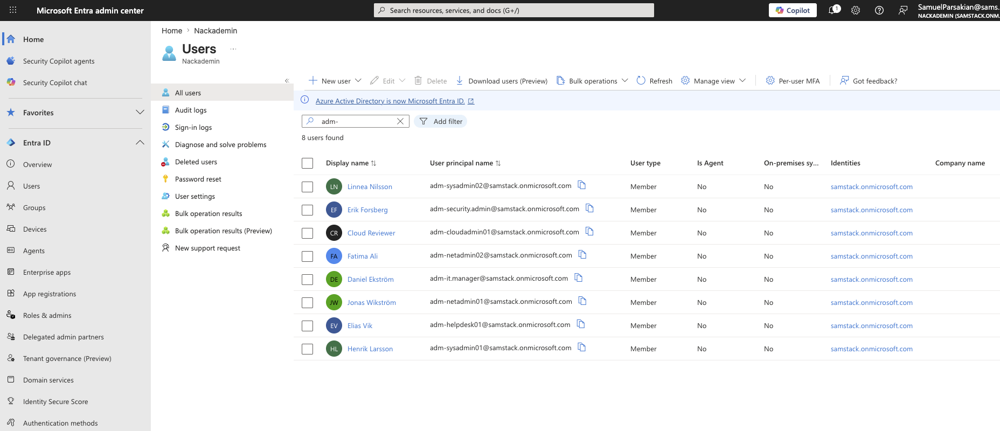
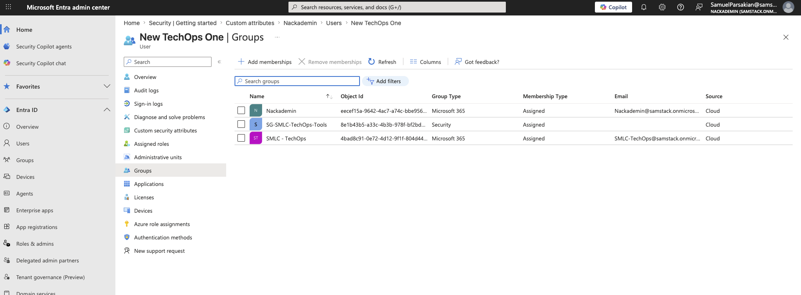
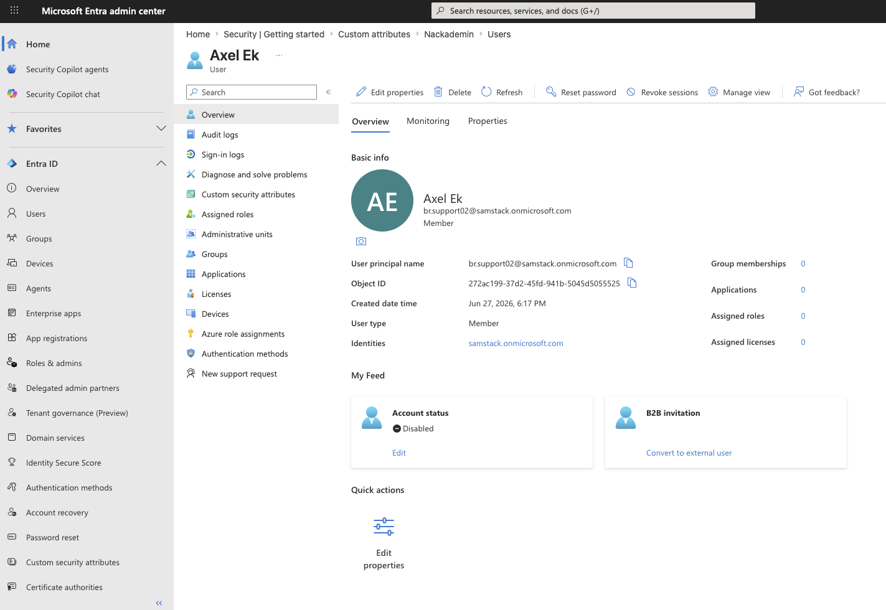

## MedSyn Microsoft 365 Admin Lab — Project Documentation

### Introduction

This document explains the practical work completed during the Microsoft 365 tenant administration lab for Sam Medsyn Lab Company.

The steps are written in the same order they were completed. The scripts and reports are saved in the repository, and screenshots are included only when they help prove or explain an important result.

The project was based on these starting documents:

- [Business scenario](/Users/sam/Projects%20for%20CV/MedSyn_Microsoft_365/Documents/business%20scenario.md)
- [SMLC company master data](/Users/sam/Projects%20for%20CV/MedSyn_Microsoft_365/Documents/SMLC_company_master_data.csv)
- [SMLC people master data](/Users/sam/Projects%20for%20CV/MedSyn_Microsoft_365/Documents/SMLC_people_master_data.csv)

### Step 01 — Tenant Baseline Capture

The project starts with the business scenario and two CSV files linked above. One CSV contains company-level information, and the other contains the planned user accounts. Together, these files describe the departments, office locations, and accounts that should exist in the Microsoft 365 tenant for Sam Medsyn Lab Company.

Before making any changes, the current state of the tenant was exported and saved. This is a normal administration practice: first capture what the environment looks like, then make changes, and later compare the result against that original baseline.

PowerShell was used for this step with the official Microsoft Graph, Exchange Online, and Microsoft Teams modules.

```powershell
# Required modules (installed once)
Install-Module Microsoft.Graph -Scope CurrentUser -Force
Install-Module ExchangeOnlineManagement -Scope CurrentUser -Force
Install-Module MicrosoftTeams -Scope CurrentUser -Force
```

```powershell
# Microsoft Graph: organization info, domains, users, licenses, groups, admin roles
Connect-MgGraph -Scopes "Organization.Read.All","Domain.Read.All","User.Read.All","Group.Read.All","RoleManagement.Read.Directory","Directory.Read.All","Sites.Read.All"

Get-MgOrganization | ConvertTo-Json -Depth 5 | Out-File "01_Organization.json"
Get-MgDomain | Export-Csv "02_AcceptedDomains.csv" -NoTypeInformation
Get-MgUser -All | Export-Csv "03_Users.csv" -NoTypeInformation
Get-MgSubscribedSku | Export-Csv "04_LicensesSubscriptions.csv" -NoTypeInformation
Get-MgGroup -All | Export-Csv "05_Groups.csv" -NoTypeInformation
# Directory role members are collected per role and saved to 06_AdminRoleAssignments.csv

Disconnect-MgGraph
```

```powershell
# Exchange Online: shared mailboxes and distribution lists
Connect-ExchangeOnline
Get-Mailbox -RecipientTypeDetails SharedMailbox | Export-Csv "07_SharedMailboxes.csv" -NoTypeInformation
Get-DistributionGroup | Export-Csv "08_DistributionLists.csv" -NoTypeInformation
Disconnect-ExchangeOnline -Confirm:$false
```

```powershell
# Microsoft Teams: current Teams list
Connect-MicrosoftTeams
Get-Team | Export-Csv "10_TeamsList.csv" -NoTypeInformation
Disconnect-MicrosoftTeams
```

The export confirmed that the tenant did not yet contain the SMLC departments, groups, shared mailboxes, distribution lists, or Teams from the project scenario. This gave the project a clean starting point for the configuration work that followed.


_Terminal output of the export script, showing each service connecting and each report being saved to the Reports folder._

With the starting state recorded in Reports/Tenant_Before_State, the project now had a clear baseline to compare against after the SMLC company structure was built.

### Step 02 — User Account Provisioning and License Assignment

Almost everything in Microsoft 365 depends on user identities. Groups, mailboxes, Teams, and permissions all need user accounts behind them, so this step created the identity layer first. The people CSV was used as the source of truth because each row already defined the account type, department, job title, office location, and contact details for each person.

Three types of accounts were created from the source data: 48 staff accounts, 8 admin-only accounts, and 2 break-glass accounts. The admin-only and break-glass accounts were created separately from normal staff accounts so daily work and administrative access stay clearly separated. Guest users were not created in this step. All new accounts use the tenant's confirmed domain, samstack.onmicrosoft.com.

```powershell
Connect-MgGraph -Scopes "User.ReadWrite.All","Organization.Read.All","Domain.Read.All"

foreach ($p in $people) {
    New-MgUser -DisplayName $p.DisplayName `
        -UserPrincipalName "$($p.Alias)@samstack.onmicrosoft.com" `
        -MailNickname $p.Alias `
        -AccountEnabled `
        -PasswordProfile @{ Password = $tempPassword; ForceChangePasswordNextSignIn = $true } `
        -GivenName $p.FirstName -Surname $p.LastName `
        -JobTitle $p.JobTitle -Department $p.Department -OfficeLocation $p.OfficeLocation `
        -BusinessPhones @($p.OfficePhone) -MobilePhone $p.MobilePhone `
        -StreetAddress $p.StreetAddress -City $p.City -State $p.StateOrProvince `
        -PostalCode $p.PostalCode -Country $p.Country -UsageLocation "SE"

    if ($p.PersonType -eq 'Staff' -and $licensedAliases -contains $p.Alias) {
        Set-MgUserLicense -UserId "$($p.Alias)@samstack.onmicrosoft.com" -AddLicenses @{SkuId = $businessBasicSkuId} -RemoveLicenses @()
    }
}

# Managers are linked in a second pass once every account exists
Set-MgUserManagerByRef -UserId $userId -OdataId "https://graph.microsoft.com/v1.0/users/$managerId"
```

Business Basic licenses were limited at this point. Only 16 seats were available, so 16 staff users received licenses and the remaining 32 staff users were left unlicensed for now. Admin-only and break-glass accounts were intentionally left unlicensed because they are not meant for daily mailbox or collaboration work.

Two reports were saved for this step:

- Reports/User_Provisioning/01_UsersCreated.csv
- Reports/User_Provisioning/02_LicenseUsageAfter.csv

Temporary passwords were generated for each account, but they are not included in this documentation.

No groups, Teams, SharePoint sites, shared mailboxes, distribution lists, or admin roles were configured in this step. Those parts were left for later steps.


_Active users page, showing the new SMLC accounts and their license status._


_Licenses page, showing Business Basic license usage after the new accounts were created._


_Users page filtered to "adm-", showing the eight admin-only accounts created in this step._

With the staff, admin, and break-glass accounts created, and the available licenses assigned to an initial group of staff users, the next steps could build on these accounts by adding groups, mail objects, Teams, and roles.

### Step 03 — Groups, Distribution Lists, and Shared Mailboxes

After the user accounts were created, the next step was to organize them so departments and sites could work together properly. This step covered three related areas: Microsoft 365 groups and security groups for collaboration and access control, distribution lists for internal communication, and shared mailboxes for department-facing email.

Microsoft 365 groups and security groups

Twelve Microsoft 365 groups were created, one for each department, site, and account type described in the scenario: SMLC-All-Staff, SMLC-HQ-Staff, SMLC-BR-Staff, SMLC-MgmtAdmin, SMLC-ITInfra, SMLC-TechOps, SMLC-BizOps, SMLC-Finance, SMLC-FieldOps, SMLC-Support, SMLC-HelpDesk, and SMLC-Admins. Nine security groups were also created so access control could be managed separately from collaboration: SG-SMLC-M365-Admins, SG-SMLC-HQ-Staff, SG-SMLC-BR-Staff, SG-SMLC-Finance-Private, SG-SMLC-HR-Private, SG-SMLC-ITInfra-Private, SG-SMLC-TechOps-Tools, SG-SMLC-FieldOps-RemoteAccess, and SG-SMLC-SharePoint-Owners.

Group membership came directly from the people CSV. Department, office location, and job title decided who belonged in each group. Admin-only and break-glass accounts were kept out of all staff, department, and site groups, and were added only to SMLC-Admins and SG-SMLC-M365-Admins. This keeps normal work separate from administrative access.

```powershell
Connect-MgGraph -Scopes "Group.ReadWrite.All","User.Read.All"

# Microsoft 365 group example
New-MgGroup -DisplayName "SMLC-Finance" -MailEnabled -MailNickname "SMLC-Finance" `
    -GroupTypes @("Unified") -SecurityEnabled:$false -Visibility "Private"

# Security group example
New-MgGroup -DisplayName "SG-SMLC-Finance-Private" -MailEnabled:$false `
    -MailNickname "SG-SMLC-Finance-Private" -SecurityEnabled

foreach ($user in $financeUsers) {
    New-MgGroupMember -GroupId $groupId -DirectoryObjectId $user.Id
}
```

Distribution lists and shared mailboxes

Ten distribution lists and nine shared mailboxes were created next, matching the scenario. The five most sensitive distribution lists — All Staff, Management, HR, Finance, and Security — were restricted so only authenticated senders from the SMLC-MgmtAdmin group can post to them. This prevents random users or external senders from emailing sensitive or company-wide lists.

```powershell
Connect-ExchangeOnline

New-DistributionGroup -Name "Finance" -Alias "finance-team" -PrimarySmtpAddress "finance-team@samstack.onmicrosoft.com"
Add-DistributionGroupMember -Identity "finance-team@samstack.onmicrosoft.com" -Member "finance.manager@samstack.onmicrosoft.com"
Set-DistributionGroup -Identity "finance-team@samstack.onmicrosoft.com" -RequireSenderAuthenticationEnabled $true `
    -AcceptMessagesOnlyFromSendersOrMembers @("smlc-mgmtadmin@samstack.onmicrosoft.com")

New-Mailbox -Shared -Name "SMLC Finance" -Alias "finance" -PrimarySmtpAddress "finance@samstack.onmicrosoft.com"
Add-MailboxPermission -Identity "finance@samstack.onmicrosoft.com" -User "finance.manager@samstack.onmicrosoft.com" -AccessRights FullAccess
Add-RecipientPermission -Identity "finance@samstack.onmicrosoft.com" -Trustee "finance.manager@samstack.onmicrosoft.com" -AccessRights SendAs
```

Two small naming adjustments were needed. First, the scenario used the same address for a distribution list and a shared mailbox in six cases (support, helpdesk, sales, finance, hr, security). Exchange does not allow two separate mail objects to share the same address. The shared mailbox kept the clean address from the scenario because customers and other departments would use that address. The matching distribution list received a "-team" suffix because it is only for internal discussion. Second, the tenant already had a few old, unrelated items named "Support," "Help Desk," "Sales," "Finance," and "HR" from earlier use, so the new shared mailboxes were given an "SMLC" prefix to avoid name conflicts.

Three reports were saved for this step:

- Reports/Collaboration_Foundation/01_GroupsCreated.csv
- Reports/Collaboration_Foundation/02_DistributionListsCreated.csv
- Reports/Collaboration_Foundation/03_SharedMailboxesCreated.csv


_Active teams and groups page, showing the SMLC Microsoft 365 groups alongside the tenant's existing items._


_Mailboxes page in the Exchange admin center, showing the new SMLC shared mailboxes among the tenant's mailboxes._


_Distribution list view in the Exchange admin center, showing the new SMLC distribution lists._

With groups, distribution lists, and shared mailboxes in place, the SMLC accounts now had the basic collaboration and email structure they needed. Teams, SharePoint, and admin roles were still left for later steps.

### Step 04 — Microsoft Teams Structure

With groups and mail already in place, this step turned the relevant Microsoft 365 groups into Microsoft Teams and added the channels each department needs for daily work.

Eight teams were created. SMLC - HQ, SMLC - Branch, SMLC - MgmtAdmin, SMLC - ITInfra, SMLC - TechOps, SMLC - BizOps, and SMLC - Finance were built from their matching Microsoft 365 groups, so the memberships from the previous step carried over automatically. SMLC - Knowledge Base did not have a matching group, so it was created as a new team and opened to all 48 staff because it is meant to be a shared reference space for the company. TechOps also included FieldOps and Support staff, because those teams work on the same support queue in daily operations.

```powershell
Connect-MicrosoftTeams

New-Team -GroupId $itInfraGroupId
Set-Team -GroupId $itInfraGroupId -DisplayName "SMLC - ITInfra"
Add-TeamUser -GroupId $itInfraGroupId -User "it.manager@samstack.onmicrosoft.com" -Role Owner

New-TeamChannel -GroupId $itInfraGroupId -DisplayName "Network"
New-TeamChannel -GroupId $financeGroupId -DisplayName "Payroll" -MembershipType Private
Add-TeamChannelUser -GroupId $financeGroupId -DisplayName "Payroll" -User "finance.manager@samstack.onmicrosoft.com"
```

Each department manager was made an owner of their team. For example, the IT Manager owns SMLC - ITInfra, and the Finance Manager owns SMLC - Finance. Knowledge Base is owned jointly by IT and TechOps because editing rights there should stay with those two departments. Admin-only and break-glass accounts were not added to any of these teams.

Thirty-seven channels were created across the eight teams, matching the channel plan for each department. Three channels were created as private channels instead of standard channels: HR Internal under SMLC - MgmtAdmin, and Payroll and Compliance under SMLC - Finance. These were limited to the staff who actually need that access, such as HR coordinators and Finance staff. One channel name from the original plan, "Forms", was rejected by Microsoft Teams as a reserved name, so it was created as "Company Forms" instead.

Three reports were saved for this step:

- Reports/Teams_Creation/01_TeamsCreated.csv
- Reports/Teams_Creation/02_ChannelsCreated.csv
- Reports/Teams_Creation/03_OwnersAndMembers.csv


_Active teams and groups page, showing the eight SMLC teams alongside the tenant's existing items._


_Channels list for SMLC - Finance, showing the Payroll and Compliance channels marked Private next to the standard channels._

With the Teams structure matching the approved departments, the next major areas were SharePoint, SharePoint permissions, admin roles, and guest users.

### Step 05 — SharePoint Sites and Folder Structure

Staff need a clear place to store and find department files. That is the purpose of this step. Every Microsoft 365 group automatically gets a SharePoint site when the group is created, so much of the SMLC SharePoint structure already existed after the groups from Step 03 were created. This step checked the ten sites from the approved design, confirmed the eight that already existed, created the two missing sites, and then added the agreed folder structure inside each site.

Eight of the ten sites did not need to be created manually: SMLC-HQ, SMLC-Branch, SMLC-MgmtAdmin, SMLC-ITInfra, SMLC-TechOps, SMLC-BizOps, SMLC-Finance, and SMLC-KnowledgeBase. These sites came automatically from their matching Microsoft 365 groups or Teams. SMLC-Policies and SMLC-Templates did not have department groups behind them in the approved design, so they were created separately as Communication Sites. They were owned by the same management account that owns the SMLC-MgmtAdmin team.

```powershell
Connect-PnPOnline -Url https://samstack-admin.sharepoint.com -Interactive

New-PnPTenantSite -Title "SMLC-Policies" -Url "https://samstack.sharepoint.com/sites/SMLC-Policies" `
    -Owner "owner@samstack.onmicrosoft.com" -TimeZone 4 -Template "SITEPAGEPUBLISHING#0" -Wait
```

A few naming differences appeared while checking the existing sites. SMLC-HQ and SMLC-Branch are based on the SMLC-HQ-Staff and SMLC-BR-Staff groups, so their site addresses still include the "-Staff" suffix from when those groups were first created. The groups and Teams were later renamed to "SMLC - HQ" and "SMLC - Branch", but the site URLs did not change. SMLC-KnowledgeBase was created from a Team with no original source group, so its site has a system-generated address instead of a clean SMLC name. The existing site addresses were not renamed because changing a SharePoint site URL later can break links that already point to it.

One access issue appeared while setting up the two new sites. Right after creation, only the named owner account had access. The admin completing the setup had to be added as a site collection administrator before folders could be created.

```powershell
Connect-PnPOnline -Url https://samstack-admin.sharepoint.com -Interactive
Set-PnPTenantSite -Identity "https://samstack.sharepoint.com/sites/SMLC-Policies" -Owners "SamuelParsakian@samstack.onmicrosoft.com"
```

This is a useful check whenever a site is created on someone else's behalf. A site may exist, but the person doing the setup still needs enough access to finish configuring it.

After the ten sites were confirmed, the agreed folder structure was added to the default document library of each site:

| Site               | Folders                                                                                                                           |
| ------------------ | --------------------------------------------------------------------------------------------------------------------------------- |
| SMLC-HQ            | Announcements, Company Policies, Templates, Forms, General Documents                                                              |
| SMLC-Branch        | Branch Operations, Field Visits, Customer Notes, Branch Reports, Local Procedures                                                 |
| SMLC-MgmtAdmin     | HR Records, Employee Documents, Contracts, Internal Policies, Management Reports                                                  |
| SMLC-ITInfra       | Network Documentation, Firewall Rules, Microsoft 365 Admin, Server Documentation, Backup Records, Security Incidents, Change Logs |
| SMLC-TechOps       | Support Procedures, Software Packages, Customer Notes, Field Reports, Troubleshooting Guides, Escalations                         |
| SMLC-BizOps        | Sales Leads, Marketing, Customer Requests, Reports, Customer Documents                                                            |
| SMLC-Finance       | Invoices, Payroll, Expenses, Tax, Reports, Vendor Payments                                                                        |
| SMLC-KnowledgeBase | Support Guides, Troubleshooting, Known Issues, Internal Procedures                                                                |
| SMLC-Policies      | Company Policies, Security Policies, HR Policies, IT Policies                                                                     |
| SMLC-Templates     | Forms, Letter Templates, Report Templates, Customer Templates                                                                     |

PnP PowerShell required a fresh sign-in for each individual site connection, which was not practical across ten sites. Instead, the folders were added by calling the SharePoint REST API directly from the browser while already signed in to the site:

```javascript
const digest = await fetch(`${siteUrl}/_api/contextinfo`, { method: "POST" });
await fetch(`${siteUrl}/_api/web/folders/add('Shared Documents/Invoices')`, {
  method: "POST",
  headers: { "X-RequestDigest": digestValue },
});
```

Permissions were kept simple in this step and matched the group-based access model already in place. The eight group-connected sites kept the same owners as their Microsoft 365 groups, and the two new sites had only their named owner set. Members groups, Visitors groups, and sharing settings were not changed here because the detailed permission work was planned for the next SharePoint step.

Four reports were saved for this step:

- Reports/SharePoint_Sites/01_SitesCreatedOrConfirmed.csv
- Reports/SharePoint_Sites/02_FoldersCreated.csv
- Reports/SharePoint_Sites/03_OwnersAndSharing.csv
- Reports/SharePoint_Sites/04_ErrorsAndLimitations.csv


_Active sites page, showing the ten SMLC SharePoint sites alongside the tenant's existing items._


_Documents library for SMLC-Policies, showing the four policy folders created for that site._

At this point, the sites and folders existed, but the permissions were still mostly at their defaults. Admin roles and guest access had also not been handled yet. The next step was therefore to apply the SharePoint permission model.

### Step 06 — SharePoint Permission Model

A folder structure is only useful if the right people can access it and the wrong people cannot. This step closed the gap between "the sites exist" and "the sites are only open to the correct groups." The previous step left one open item: when SMLC-Policies and SMLC-Templates were created, only their named owner had access, and the second owner could not be added immediately. This step started by fixing that issue and then applied the agreed SMLC permission model across all ten sites.

The second owner was added successfully this time because the access issue on the two sites had already been fixed. The same account was also made a full site collection administrator on both sites, not only a member of the Owners group. That matches what "second owner" means in practice.

```javascript
const digest = await fetch(`${siteUrl}/_api/contextinfo`, { method: "POST" });
await fetch(`${siteUrl}/_api/web/associatedownergroup/users`, {
  method: "POST",
  headers: { "X-RequestDigest": digestValue },
  body: JSON.stringify({
    __metadata: { type: "SP.User" },
    LoginName: "operations.manager@samstack.onmicrosoft.com",
  }),
});
```

The rest of the work followed the agreed permission table. Existing Microsoft 365 groups were used instead of individual user accounts, so access can stay accurate when people join or leave a department:

| Site               | Change made                                                                                                              |
| ------------------ | ------------------------------------------------------------------------------------------------------------------------ |
| SMLC-HQ            | SMLC-ITInfra added as an additional owner; SMLC-Branch given optional read access                                        |
| SMLC-Branch        | SMLC-ITInfra added as an additional owner; SMLC-MgmtAdmin given optional read access                                     |
| SMLC-MgmtAdmin     | No change - kept restricted to MgmtAdmin only                                                                            |
| SMLC-ITInfra       | No change - kept restricted to ITInfra only                                                                              |
| SMLC-TechOps       | SMLC-ITInfra added as an additional owner, covering its support role across FieldOps and Support                         |
| SMLC-BizOps        | SMLC-MgmtAdmin added as an additional owner                                                                              |
| SMLC-Finance       | No change - kept restricted to Finance only                                                                              |
| SMLC-KnowledgeBase | SMLC-TechOps and SMLC-ITInfra added with edit access; SMLC-All-Staff given read-only access                              |
| SMLC-Policies      | SMLC-MgmtAdmin and SMLC-ITInfra added as owners, SMLC-MgmtAdmin given edit access, SMLC-All-Staff given read-only access |
| SMLC-Templates     | SMLC-MgmtAdmin and SMLC-ITInfra added as owners, SMLC-MgmtAdmin given edit access, SMLC-All-Staff given read-only access |

Each group could be added directly by email address, the same way an individual person would be added. This works because Microsoft 365 groups can be used as SharePoint permission principals. Finance, MgmtAdmin, and ITInfra were deliberately left unchanged because the design requires those areas to stay closed to general staff.

External sharing was turned off on all ten sites at the end of this step, so none of these sites can be shared with people outside the organisation:

```powershell
Connect-PnPOnline -Url https://samstack-admin.sharepoint.com -Interactive
Set-PnPTenantSite -Identity "https://samstack.sharepoint.com/sites/SMLC-Finance" -SharingCapability Disabled
```

Six reports were saved for this step:

- Reports/SharePoint_Permissions/01_PermissionActions.csv
- Reports/SharePoint_Permissions/02_OwnersSnapshot.csv
- Reports/SharePoint_Permissions/03_MembersSnapshot.csv
- Reports/SharePoint_Permissions/04_VisitorsSnapshot.csv
- Reports/SharePoint_Permissions/05_SharingCapability.csv
- Reports/SharePoint_Permissions/06_ErrorsAndLimitations.csv


_Site permissions page for SMLC-Policies, showing operations.manager listed as a site owner alongside the MgmtAdmin and ITInfra groups._


_Group membership panel for SMLC-Finance, showing access limited to the Finance team only._

Admin roles and guest access had still not been reviewed at this point. SharePoint itself was now in a better state, with permissions matching the design and external sharing turned off everywhere. The next step moved back to Exchange Online to add basic email security rules.

### Step 07 — Exchange Online and Basic Email Security

Mailboxes, shared mailboxes, and distribution lists were already created in Step 03, but the mail flow itself had not been protected yet. This step first checked that the earlier mail setup was still correct, then added two basic mail flow protections that a small company would normally enable early: a warning banner for email from outside the company, and a block on risky attachment file types that are commonly used to deliver malware.

```powershell
Connect-ExchangeOnline

New-TransportRule -Name "SMLC - External Sender Warning" `
    -FromScope NotInOrganization -SentToScope InOrganization `
    -ApplyHtmlDisclaimerLocation Prepend -ApplyHtmlDisclaimerFallbackAction Wrap `
    -ApplyHtmlDisclaimerText "Caution: this email came from an external sender. Do not click links or open attachments unless you recognise the sender."

New-TransportRule -Name "SMLC - Block Risky Attachments" `
    -AttachmentExtensionMatchesWords exe,bat,cmd,scr,vbs,js,ps1,msi,hta,jar,reg `
    -RejectMessageReasonText "This file type is blocked for security reasons. Contact IT support if you need to share this file."
```

Before these rules were created, the tenant had no mail flow rules, so both rules were added cleanly. The five sensitive distribution lists from Step 03 - All Staff, Management, HR, Finance, and Security - were checked again and still only accepted mail from the management group. The nine shared mailboxes were also checked against the original design. Each shared mailbox still granted Full Access and Send As rights only to the department staff it was created for. None of the 35 mailboxes in the tenant had forwarding configured, which is the expected result for a controlled lab tenant.

One setting could not be completed in this step. Blocking automatic forwarding to external addresses is normally done through the outbound spam filter policy. However, this tenant had never had policy customisation enabled before, and Exchange Online requires that one-time setup before the policy can be changed.

```powershell
Enable-OrganizationCustomization
Set-HostedOutboundSpamFilterPolicy -Identity Default -AutoForwardingMode Off
Get-Mailbox -ResultSize Unlimited | Select-Object UserPrincipalName, ForwardingSmtpAddress, ForwardingAddress
```

That one-time setup command was run, and the forwarding setting was checked again on a separate day to give Microsoft time to apply the change. The setting was still rejected with the same message. Because of that, AutoForwardingMode remains at the tenant default for now instead of being switched to Off. This was checked twice across two sessions, and both checks confirmed that no mailbox in the tenant had a forwarding rule configured. So although the tenant-wide block is still open, there was no active forwarding exposure at the time of the review.

Anti-spam, anti-malware, and basic anti-phishing protection were confirmed as present and active. These protections come as standard with every Exchange Online mailbox:

```powershell
Get-HostedContentFilterPolicy -Identity Default
Get-MalwareFilterPolicy -Identity Default
Get-AntiPhishPolicy -Identity "Office365 AntiPhish Default"
Get-SafeLinksPolicy
Get-SafeAttachmentPolicy
```

Safe Links and Safe Attachments protect users when they open suspicious links or attachments. Those features belong to Microsoft Defender for Office 365 and are not included in the Business Basic plan SMLC is using. They are therefore listed as a planned upgrade, not as a mistake in the setup. The security@samstack.onmicrosoft.com mailbox used for alerts was also confirmed to still exist and still had the same access it received in Step 03.

Eight reports were saved for this step:

- Reports/Exchange_Security/00_TransportRules_Before.csv
- Reports/Exchange_Security/01_AcceptedDomains.csv
- Reports/Exchange_Security/02_TransportRules.csv
- Reports/Exchange_Security/03_DistributionListRestrictions.csv
- Reports/Exchange_Security/04b_OutboundForwardingPolicy.csv
- Reports/Exchange_Security/05_MailboxForwardingStatus.csv
- Reports/Exchange_Security/06_SharedMailboxPermissions.csv
- Reports/Exchange_Security/07_AntiSpamMalwarePhishingAvailability.csv


_Mail flow page in the Exchange admin center, showing the two new SMLC rules enabled and enforced._


_An email received from outside the organisation, showing the warning banner added above the message body._

Conditional Access, MFA, and the remaining Defender features were still left for future work. The auto-forwarding block remained the one open item from this step and should be switched on once Microsoft's side finishes applying the required customisation. Everything else from this step was in place, so the next check focused on Microsoft 365 service health and the Message center.

### Step 08 — Service Health and Message Center

A Microsoft 365 tenant does not run completely on its own. Administrators also need to watch what Microsoft reports about the service. This step was a review rather than a configuration change. Service health was checked to see whether anything was currently broken, and Message center was checked for upcoming Microsoft changes that could affect the tenant.

```powershell
Connect-MgGraph -Scopes "ServiceHealth.Read.All","ServiceMessage.Read.All"

Get-MgServiceAnnouncementHealthOverview | Export-Csv "01_ServiceHealth.csv" -NoTypeInformation
Get-MgServiceAnnouncementMessage -Top 10 | Select-Object Title, Services, LastModifiedDateTime
```

Service health showed three advisories at the time of the check: a minor meeting room availability issue in Exchange Online, a webhook notification issue in Microsoft To Do, and a SharePoint Online search schema display issue. These were Microsoft-side advisories, not tenant configuration problems. None of them affected anything SMLC depends on. The other listed services, including Teams, SharePoint, Exchange, and Entra, showed as healthy.

Message center had 404 items, which was too many to review one by one in detail. The review focused on the messages most relevant to this tenant. One important update stood out: Microsoft Entra ID self-service password reset will require every user to have a registered authentication method starting 6 September 2026. This matters because SMLC has not set up multi-factor authentication or Conditional Access yet. When that work begins, every user account will need a registered method before the deadline, otherwise users will not be able to reset their own passwords and an admin will have to do it manually.

Two reports were saved for this step:

- Reports/Service_Health_Message_Center/01_ServiceHealth.csv
- Reports/Service_Health_Message_Center/02_MessageCenterHighlight.csv


_Service health page, showing the three active advisories and the healthy status of the remaining services._


_Message center inbox, showing the volume and range of messages Microsoft sends to tenant admins._

Nothing in this step needed immediate fixing. However, the password reset change is important for later because MFA and Conditional Access have not been configured yet. After reviewing service health and upcoming Microsoft changes, the next step was to manually check who had access to what across the tenant.

### Step 09 — Manual Access Review and Guest Access Test

This was the closing check for Part 1. The goal was to review group membership from a practical security point of view: does each person actually need the access they have? After that, the step tested what happens when an outside guest is invited into the tenant.

Membership in Finance, MgmtAdmin, ITInfra, BizOps, TechOps, and Knowledge Base was exported and checked against the original design. The dedicated security groups were reviewed as well: SG-SMLC-Finance-Private, SG-SMLC-HR-Private, SG-SMLC-ITInfra-Private, SG-SMLC-TechOps-Tools, and SG-SMLC-FieldOps-RemoteAccess.

```powershell
Connect-MgGraph -Scopes "Group.Read.All","GroupMember.Read.All","User.Read.All"

foreach ($groupName in @("SMLC - Finance","SMLC - MgmtAdmin","SMLC - ITInfra","SG-SMLC-Finance-Private","SG-SMLC-HR-Private")) {
    $group = Get-MgGroup -Filter "displayName eq '$groupName'"
    Get-MgGroupMember -GroupId $group.Id -All | ForEach-Object { (Get-MgUser -UserId $_.Id).UserPrincipalName }
}
```

Everything matched the design. Finance still had only its three Finance staff, ITInfra still had only its six IT staff, and nobody outside HR was in the HR security group. Knowledge Base, Policies, and Templates were not re-checked from the beginning because SharePoint had not changed since Step 06. Their read-only all-staff access was already recorded there.

The admin-only and break-glass accounts were the other important part of this review. All ten of them - the eight `adm-` accounts plus the two break-glass accounts - appeared only in SMLC-Admins and SG-SMLC-M365-Admins. They did not appear in any department group, security group, Team, or shared mailbox. This confirms that daily work access and emergency/admin access stayed separate, as planned in Step 02.

The second half of the step tested guest access. Two guest users were planned: a vendor contact for TechOps and a clinic contact for BizOps. Each guest was meant to receive only a small, limited amount of access.

```powershell
New-MgInvitation -InvitedUserEmailAddress "vendor.tech@example.com" -InvitedUserDisplayName "Vendor Tech (Guest)" `
    -InviteRedirectUrl "https://myapps.microsoft.com" -SendInvitationMessage:$false
```

Both invitations were rejected by the tenant before any guest account could be created. Finding the reason took a few checks. The setting that controls who can send invitations was already open, there were no Conditional Access policies in place, and the cross-tenant collaboration settings allowed external users by default. The real cause was Security Defaults, which is enabled for this tenant. Security Defaults enforces baseline protections, including multi-factor authentication requirements, before sensitive actions such as guest invitations are allowed. Because MFA has not been set up for users yet - the same gap noted in the previous Message Center review - the guest invitations could not go through.

As a result, no guest accounts were created in the tenant. For this stage of the project, that is actually a useful result because it shows the tenant is refusing external access before any guest permissions can be assigned. Security Defaults were not turned off just to force the test accounts through, because that would weaken the tenant only to complete a lab test. The setting was left as it was found.

Six reports were saved for this step:

- Reports/Manual_Access_Review/01_GroupMembership.csv
- Reports/Manual_Access_Review/02_AdminSeparationCheck.csv
- Reports/Manual_Access_Review/03_AdminAccountScope.csv
- Reports/Manual_Access_Review/04_ErrorsAndLimitations.csv
- Reports/Guest_Access_Test/01_GuestsCreated.csv
- Reports/Guest_Access_Test/09_RootCauseAndConclusion.csv


_Microsoft Entra admin center, showing Security Defaults switched on for the tenant._


_Users list filtered to guest accounts, showing none exist after the blocked invitation attempt._

This closed Part 1. Every account, group, site, and mailbox had been checked against the design at least once. The one open area - guest access - turned out to already be blocked by the tenant's security settings. Part 2 continues from here with onboarding, offboarding, and incident response.

### Step 10 — Onboarding, Offboarding, and Incident Response Test

After the design review, the final practical step was to test common admin situations. This included a new starter joining TechOps, a Branch Support user leaving the company, and a Finance account being treated as compromised.

The onboarding test created `new.techops01`, added the account to SMLC - TechOps and the matching security group, and then checked the result.

```powershell
Connect-MgGraph -Scopes "User.ReadWrite.All","Group.ReadWrite.All","Organization.Read.All"

New-MgUser -DisplayName "New TechOps One" -UserPrincipalName "new.techops01@samstack.onmicrosoft.com" `
    -MailNickname "new.techops01" -AccountEnabled `
    -PasswordProfile @{ Password = $tempPassword; ForceChangePasswordNextSignIn = $true } `
    -UsageLocation "SE" -Department "TechOps" -JobTitle "TechOps Staff"

Add-MgGroupMember -GroupId $techOpsGroupId -DirectoryObjectId $newUser.Id
Add-MgGroupMember -GroupId $techOpsSecurityGroupId -DirectoryObjectId $newUser.Id

Get-MgUserMemberOf -UserId $newUser.Id | Select-Object DisplayName
```

Knowledge Base access did not need to be added separately. The TechOps group was already granted access to that site in Step 06, so anyone added to TechOps inherits that access automatically. A license was not assigned because all 25 Business Basic seats were already in use. Licensing was skipped instead of forced, and the account was left unlicensed with a note explaining why. A membership check confirmed that the account belonged only to TechOps-related groups. It was not accidentally added to Finance, MgmtAdmin, ITInfra, or any admin group.

The offboarding test used `br.support02`, an existing Branch Support account.

```powershell
Connect-MgGraph -Scopes "User.ReadWrite.All","Group.ReadWrite.All"

$user = Get-MgUser -UserId "br.support02@samstack.onmicrosoft.com"
Update-MgUser -UserId $user.Id -AccountEnabled:$false
Revoke-MgUserSignInSession -UserId $user.Id

Get-MgUserMemberOf -UserId $user.Id -All | ForEach-Object {
    Remove-MgGroupMemberByRef -GroupId $_.Id -DirectoryObjectId $user.Id
}
```

Sign-in was blocked and the account's sessions were revoked. Then group removal started, which revealed an important detail: Microsoft Graph can remove someone from a Microsoft 365 group or security group, but it cannot remove them from a classic mail-enabled distribution list. In that case, Graph returned a "cannot update" error. Three of the account's eleven groups were classic distribution lists, so those memberships had to be removed separately through Exchange Online:

```powershell
Connect-ExchangeOnline
Remove-MailboxPermission -Identity "support@samstack.onmicrosoft.com" -User "br.support02@samstack.onmicrosoft.com" -AccessRights FullAccess
Remove-RecipientPermission -Identity "support@samstack.onmicrosoft.com" -Trustee "br.support02@samstack.onmicrosoft.com" -AccessRights SendAs
Remove-DistributionGroupMember -Identity "allstaff@samstack.onmicrosoft.com" -Member "br.support02@samstack.onmicrosoft.com"
```

The account's Full Access and Send As rights on the shared Support mailbox were removed through Exchange Online as well. A OneDrive cleanup check found nothing because the account had never been licensed, so it never had a OneDrive. By the end of the offboarding test, the account was blocked from sign-in, signed out, and removed from everything it had access to.

The incident response demo treated `finance.assistant` as a compromised account.

```powershell
$user = Get-MgUser -UserId "finance.assistant@samstack.onmicrosoft.com"
Update-MgUser -UserId $user.Id -AccountEnabled:$false
Update-MgUser -UserId $user.Id -PasswordProfile @{ Password = $newPassword; ForceChangePasswordNextSignIn = $true }
Revoke-MgUserSignInSession -UserId $user.Id
Get-MgUserMemberOf -UserId $user.Id -All | ForEach-Object { (Get-MgGroup -GroupId $_.Id).DisplayName }
Get-MgAuditLogSignIn -Filter "userPrincipalName eq 'finance.assistant@samstack.onmicrosoft.com'" -Top 10

Connect-ExchangeOnline
Get-Mailbox -Identity "finance.assistant@samstack.onmicrosoft.com" | Select-Object ForwardingSmtpAddress, ForwardingAddress

Update-MgUser -UserId $user.Id -AccountEnabled:$true
```

Sign-in was blocked immediately and active sessions were revoked. A password reset was attempted next, but the tenant rejected it with an insufficient-privileges error. This was similar to the Security Defaults issue from the guest invitation test: the tenant requires stronger authentication before allowing some sensitive admin actions. The password was left unchanged instead of being forced through another method. Mailbox forwarding was checked and confirmed clear. Group membership was reviewed and matched what was expected for a Finance staff member based at HQ: Finance, the Finance security group, the office group, and all-staff groups. Nothing pointed to unusual access. Recent sign-in activity could not be checked because Business Basic does not include access to sign-in logs through this API, which is similar to the Defender feature limitations noted in Step 07. Sign-in was turned back on at the end so the account and lab could continue working. The revoked sessions stayed revoked, so the account would still need a fresh sign-in.

Eight reports were saved across the two folders for this step:

- Reports/Onboarding_Offboarding/01_OnboardingTest.csv
- Reports/Onboarding_Offboarding/02_OffboardingTest.csv
- Reports/Onboarding_Offboarding/03_OffboardingMailboxAccess.csv
- Reports/Onboarding_Offboarding/04_RevokeSessionsFix.csv
- Reports/Onboarding_Offboarding/05_OffboardingDistributionLists.csv
- Reports/Incident_Response_Demo/01_IncidentResponseActions.csv
- Reports/Incident_Response_Demo/02_MailboxForwardingCheck.csv
- Reports/Incident_Response_Demo/04_RevokeSessionsFix.csv


_Microsoft Entra admin center, showing new.techops01's group membership limited to TechOps._


_Microsoft Entra admin center, showing br.support02's account status as disabled and group memberships at zero._

This was the last build-and-test step in the project. Every account type, every department, and three common admin situations - someone joining, someone leaving, and a possible compromise - had now been tested and documented. The remaining work was to pull the project record together into a finished write-up.

### Project Summary

The project was completed in a clear order: user accounts, groups and mail, Teams, SharePoint sites, SharePoint permissions, Exchange security rules, Service Health and Message Center, manual access review with guest access testing, and finally onboarding, offboarding, and incident response testing. Each step built on the accounts, groups, sites, or permissions created earlier.

**Business Basic limitations found along the way**

A recurring theme in the second half of the project was understanding where the Business Basic plan stops and where a higher plan would be needed:

- Safe Links and Safe Attachments (Microsoft Defender for Office 365) are not included - confirmed in Step 07.
- Sign-in log review through the Graph API is not available without an Entra ID premium plan - confirmed in Step 10, and the same restriction applies to the Identity Protection features that depend on it.
- Resetting another user's password and inviting a guest both depend on Security Defaults being satisfied with a stronger authentication context than a standard admin session provides - found in Step 09 and Step 10.
- The outbound spam policy could not be customised until a one-time tenant unlock (`Enable-OrganizationCustomization`) was run, and even after running it, the change was still propagating at the time of writing - found in Step 07.

None of these became full blockers. Each limitation was checked, documented, and either handled with a safe alternative or left as a clearly labelled open item.

**Planned improvements for a future phase**

If this project continued beyond the current scope, the next practical improvements would be:

- Setting up multi-factor authentication and Conditional Access, which would also resolve the guest invitation and password reset restrictions found in Steps 09 and 10.
- Finishing the auto-forwarding block once Microsoft's side has fully applied the organisation customisation change from Step 07.
- Adding a custom domain with DKIM and DMARC, once SMLC moves off the default `samstack.onmicrosoft.com` address.
- Assigning the admin-only accounts their actual Entra ID roles (Privileged Role Administrator, Exchange Administrator, and so on), since they currently exist and sit in the right groups but have not yet been given the roles their job titles describe.
- Revisiting Defender for Office 365 and Entra ID Premium if the company's budget allows it, to close the Safe Links, Safe Attachments, and sign-in log gaps found along the way.

This completes the build and testing planned for this phase of the project.
