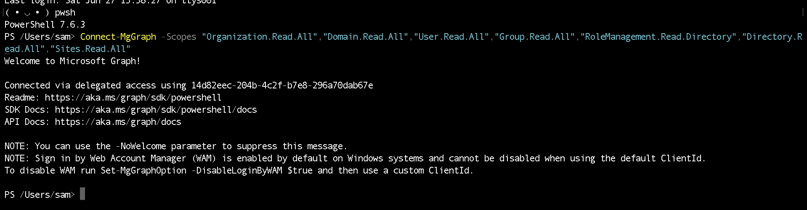
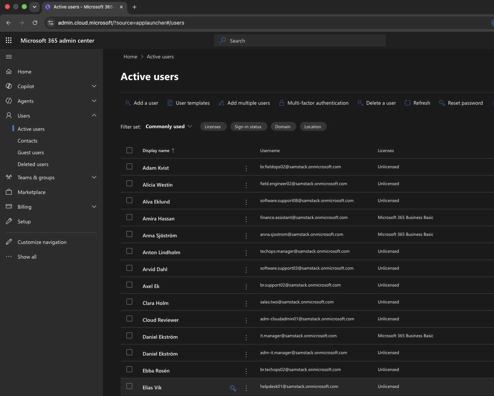
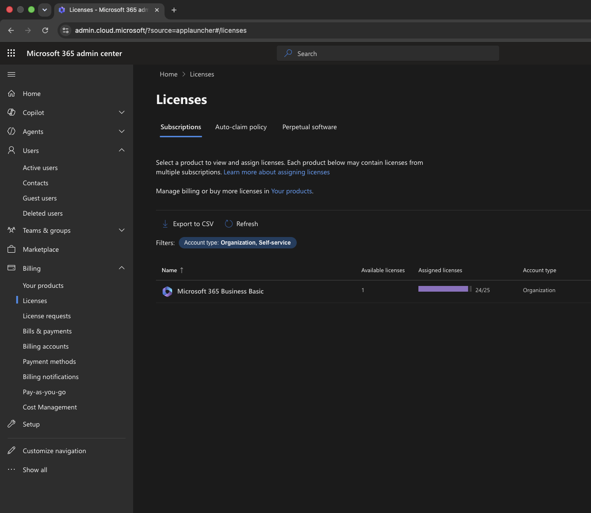
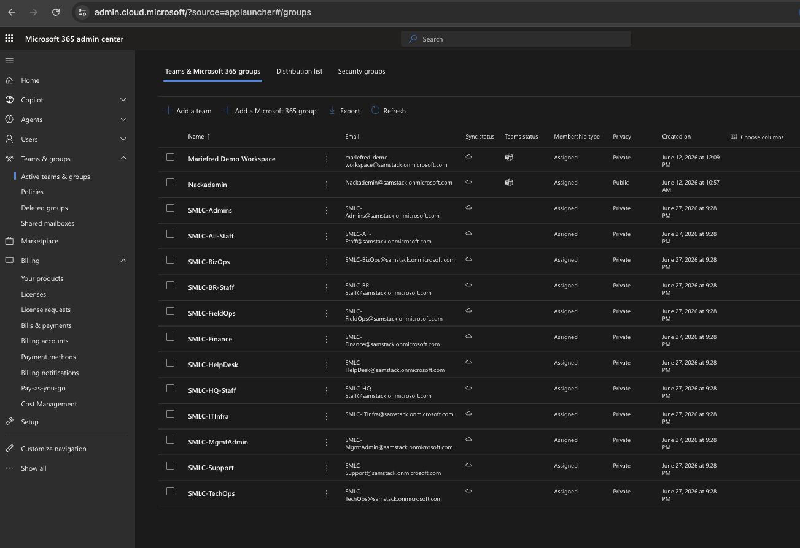
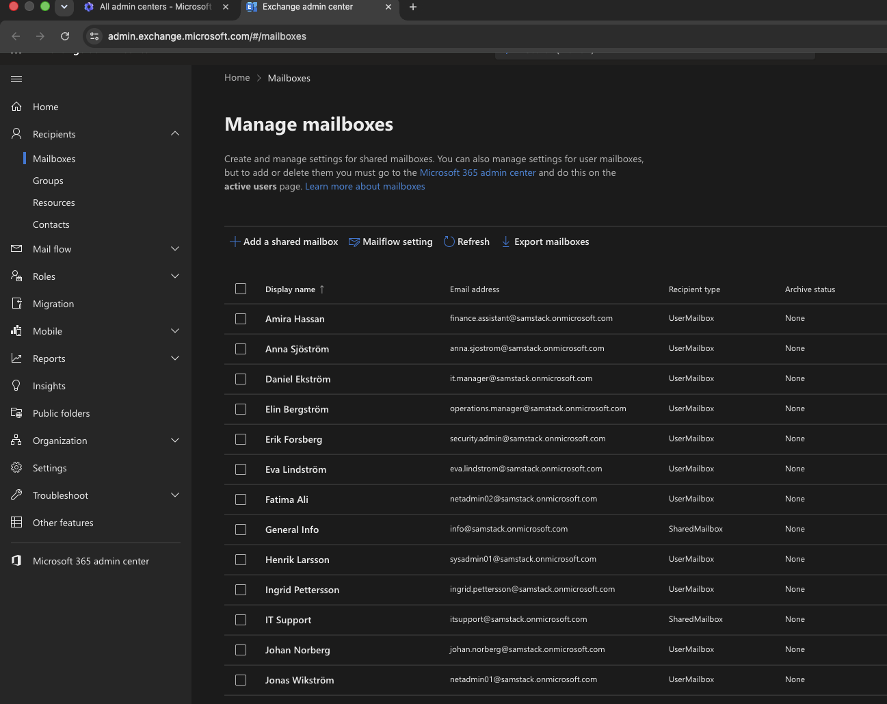
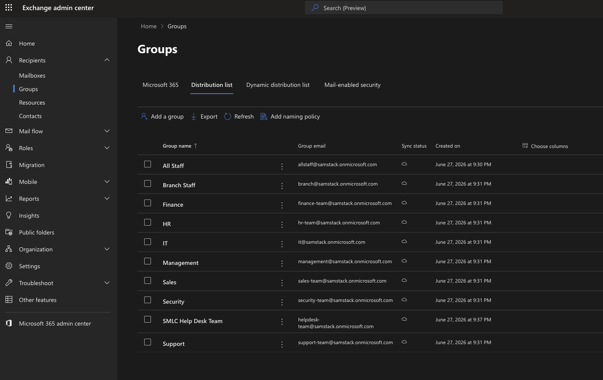

## MedSyn Microsoft 365 Admin Lab — Project Documentation

### Introduction

This document records the practical work completed during the Microsoft 365 tenant administration lab for Sam Medsyn Lab Company.

The work is documented in the same order it was completed. Scripts and reports are saved in the repository, and screenshots are used only where a visual result is useful for review.

Step 01 — Tenant Baseline Capture

The project starts from a short business scenario and two CSV files: one with company-level information and one with the planned user accounts. These files describe the departments, sites, and accounts that the Microsoft 365 tenant for Sam Medsyn Lab Company should eventually contain.

Before any configuration was made, the current state of the tenant was collected and saved. This follows common practice in real administration work, where the starting point of an environment is recorded before changes are introduced, so that later changes can be compared against a known baseline.

PowerShell was used for this step, together with the official Microsoft Graph, Exchange Online, and Microsoft Teams modules.

```powershell
# Required modules (installed once)
Install-Module Microsoft.Graph -Scope CurrentUser -Force
Install-Module ExchangeOnlineManagement -Scope CurrentUser -Force
Install-Module MicrosoftTeams -Scope CurrentUser -Force
```

```powershell
# Microsoft Graph: organization info, domains, users, licenses, groups, admin roles
Connect-MgGraph -Scopes "Organization.Read.All","Domain.Read.All","User.Read.All","Group.Read.All","RoleManagement.Read.Directory","Directory.Read.All","Sites.Read.All"

Get-MgOrganization | ConvertTo-Json -Depth 5 | Out-File "01_Organization.json"
Get-MgDomain | Export-Csv "02_AcceptedDomains.csv" -NoTypeInformation
Get-MgUser -All | Export-Csv "03_Users.csv" -NoTypeInformation
Get-MgSubscribedSku | Export-Csv "04_LicensesSubscriptions.csv" -NoTypeInformation
Get-MgGroup -All | Export-Csv "05_Groups.csv" -NoTypeInformation
# Directory role members are collected per role and saved to 06_AdminRoleAssignments.csv

Disconnect-MgGraph
```

```powershell
# Exchange Online: shared mailboxes and distribution lists
Connect-ExchangeOnline
Get-Mailbox -RecipientTypeDetails SharedMailbox | Export-Csv "07_SharedMailboxes.csv" -NoTypeInformation
Get-DistributionGroup | Export-Csv "08_DistributionLists.csv" -NoTypeInformation
Disconnect-ExchangeOnline -Confirm:$false
```

```powershell
# Microsoft Teams: current Teams list
Connect-MicrosoftTeams
Get-Team | Export-Csv "10_TeamsList.csv" -NoTypeInformation
Disconnect-MicrosoftTeams
```

The export confirmed that the tenant did not yet contain any of the SMLC departments, groups, shared mailboxes, distribution lists, or Teams described in the project scenario. This gives a clear, fresh starting point for the configuration steps that follow.


_Terminal output of the export script, showing each service connecting and each report being saved to the Reports folder._

With the starting state recorded in Reports/Tenant_Before_State, there is now a clear baseline to compare against once the SMLC company structure is configured.

Step 02 — User Account Provisioning and License Assignment

This step builds the user identity structure for Sam Medsyn Lab Company from the people CSV file. The CSV is treated as the source of truth: each row already defines the account type, department, job title, office location, and contact details that the new accounts should have.

Three types of accounts were created from the source data: 48 staff accounts, 8 admin-only accounts, and 2 break-glass accounts. Admin-only and break-glass accounts were created separately from the staff accounts they relate to, so that daily work and administrative access stay apart. Guest users were not created in this step. All new accounts use the tenant's confirmed domain, samstack.onmicrosoft.com.

```powershell
Connect-MgGraph -Scopes "User.ReadWrite.All","Organization.Read.All","Domain.Read.All"

foreach ($p in $people) {
    New-MgUser -DisplayName $p.DisplayName `
        -UserPrincipalName "$($p.Alias)@samstack.onmicrosoft.com" `
        -MailNickname $p.Alias `
        -AccountEnabled `
        -PasswordProfile @{ Password = $tempPassword; ForceChangePasswordNextSignIn = $true } `
        -GivenName $p.FirstName -Surname $p.LastName `
        -JobTitle $p.JobTitle -Department $p.Department -OfficeLocation $p.OfficeLocation `
        -BusinessPhones @($p.OfficePhone) -MobilePhone $p.MobilePhone `
        -StreetAddress $p.StreetAddress -City $p.City -State $p.StateOrProvince `
        -PostalCode $p.PostalCode -Country $p.Country -UsageLocation "SE"

    if ($p.PersonType -eq 'Staff' -and $licensedAliases -contains $p.Alias) {
        Set-MgUserLicense -UserId "$($p.Alias)@samstack.onmicrosoft.com" -AddLicenses @{SkuId = $businessBasicSkuId} -RemoveLicenses @()
    }
}

# Managers are linked in a second pass once every account exists
Set-MgUserManagerByRef -UserId $userId -OdataId "https://graph.microsoft.com/v1.0/users/$managerId"
```

Business Basic licenses were limited: only 16 seats were available at the time of this step, so 16 staff users were licensed and the remaining 32 staff users were left unlicensed for now. Admin-only and break-glass accounts were kept unlicensed on purpose, since they are not meant to be used for daily mailbox or collaboration work.

Two reports were saved for this step:

- Reports/User_Provisioning/01_UsersCreated.csv
- Reports/User_Provisioning/02_LicenseUsageAfter.csv

Temporary passwords were generated for each account, but they are kept only in a local file (\_tmp_AI_Agent/temp_passwords.csv) and are not part of this documentation.

No groups, Teams, SharePoint sites, shared mailboxes, distribution lists, or admin roles were configured in this step. These are planned for later chapters.


_Active users page, showing the new SMLC accounts and their license status._


_Licenses page, showing Business Basic license usage after the new accounts were created._

With the staff, admin, and break-glass accounts now in place and the available licenses assigned to a pilot group of staff users, the next steps can build on these accounts, for example by adding groups and assigning admin roles.

Step 03 — Groups, Distribution Lists, and Shared Mailboxes

With the user accounts in place, the next step was to organize them so departments and sites could actually work and communicate as teams. This covered three related parts of the design: Microsoft 365 groups and security groups for collaboration and access control, distribution lists for internal communication, and shared mailboxes for department-facing email.

Microsoft 365 groups and security groups

Twelve Microsoft 365 groups were created, one for each department, site, and account type described in the scenario: SMLC-All-Staff, SMLC-HQ-Staff, SMLC-BR-Staff, SMLC-MgmtAdmin, SMLC-ITInfra, SMLC-TechOps, SMLC-BizOps, SMLC-Finance, SMLC-FieldOps, SMLC-Support, SMLC-HelpDesk, and SMLC-Admins. Alongside these, nine security groups were created to handle access control separately from collaboration: SG-SMLC-M365-Admins, SG-SMLC-HQ-Staff, SG-SMLC-BR-Staff, SG-SMLC-Finance-Private, SG-SMLC-HR-Private, SG-SMLC-ITInfra-Private, SG-SMLC-TechOps-Tools, SG-SMLC-FieldOps-RemoteAccess, and SG-SMLC-SharePoint-Owners.

Membership in every group came directly from the people CSV: department, office location, and job title decided who belonged where. Admin-only and break-glass accounts were kept out of every staff, department, and site group, and only added to SMLC-Admins and SG-SMLC-M365-Admins. This keeps daily work and administrative access clearly separated, in line with the rest of the project.

```powershell
Connect-MgGraph -Scopes "Group.ReadWrite.All","User.Read.All"

# Microsoft 365 group example
New-MgGroup -DisplayName "SMLC-Finance" -MailEnabled -MailNickname "SMLC-Finance" `
    -GroupTypes @("Unified") -SecurityEnabled:$false -Visibility "Private"

# Security group example
New-MgGroup -DisplayName "SG-SMLC-Finance-Private" -MailEnabled:$false `
    -MailNickname "SG-SMLC-Finance-Private" -SecurityEnabled

foreach ($user in $financeUsers) {
    New-MgGroupMember -GroupId $groupId -DirectoryObjectId $user.Id
}
```

Distribution lists and shared mailboxes

Ten distribution lists and nine shared mailboxes were created next, matching the lists in the scenario. The five most sensitive distribution lists — All Staff, Management, HR, Finance, and Security — were restricted so that only authenticated senders from the SMLC-MgmtAdmin group can post to them, which stops random or external senders from reaching the whole company.

```powershell
Connect-ExchangeOnline

New-DistributionGroup -Name "Finance" -Alias "finance-team" -PrimarySmtpAddress "finance-team@samstack.onmicrosoft.com"
Add-DistributionGroupMember -Identity "finance-team@samstack.onmicrosoft.com" -Member "finance.manager@samstack.onmicrosoft.com"
Set-DistributionGroup -Identity "finance-team@samstack.onmicrosoft.com" -RequireSenderAuthenticationEnabled $true `
    -AcceptMessagesOnlyFromSendersOrMembers @("smlc-mgmtadmin@samstack.onmicrosoft.com")

New-Mailbox -Shared -Name "SMLC Finance" -Alias "finance" -PrimarySmtpAddress "finance@samstack.onmicrosoft.com"
Add-MailboxPermission -Identity "finance@samstack.onmicrosoft.com" -User "finance.manager@samstack.onmicrosoft.com" -AccessRights FullAccess
Add-RecipientPermission -Identity "finance@samstack.onmicrosoft.com" -Trustee "finance.manager@samstack.onmicrosoft.com" -AccessRights SendAs
```

Two small naming adjustments were needed along the way. The scenario uses the same address for a distribution list and a shared mailbox in six cases (support, helpdesk, sales, finance, hr, security), but Exchange does not allow two different mailboxes to share one address. The shared mailbox kept the clean address from the scenario, since that is the one customers and other departments would actually email, and the matching distribution list got a "-team" suffix instead, since it is only used for internal discussion. Separately, this tenant already had a few old, unrelated items named "Support," "Help Desk," "Sales," "Finance," and "HR" from earlier unrelated use, so the new shared mailboxes for those were given an "SMLC" prefix to avoid clashing with them.

Three reports were saved for this step:

- Reports/Collaboration_Foundation/01_GroupsCreated.csv
- Reports/Collaboration_Foundation/02_DistributionListsCreated.csv
- Reports/Collaboration_Foundation/03_SharedMailboxesCreated.csv


_Active teams and groups page, showing the SMLC Microsoft 365 groups alongside the tenant's existing items._


_Mailboxes page in the Exchange admin center, showing the new SMLC shared mailboxes among the tenant's mailboxes._


_Distribution list view in the Exchange admin center, showing the new SMLC distribution lists._

Teams, SharePoint sites, and admin role assignments are still untouched at this point. With groups, distribution lists, and shared mailboxes now in place, the SMLC accounts have the collaboration and email structure they need, and the next steps can move on to Teams and SharePoint.
