## MedSyn Microsoft 365 Admin Lab — Project Documentation

### Introduction

This document records the practical work completed during the Microsoft 365 tenant administration lab for Sam Medsyn Lab Company.

The work is documented in the same order it was completed. Scripts and reports are saved in the repository, and screenshots are used only where a visual result is useful for review.

Step 01 — Tenant Baseline Capture

The project starts from a short business scenario and two CSV files: one with company-level information and one with the planned user accounts. These files describe the departments, sites, and accounts that the Microsoft 365 tenant for Sam Medsyn Lab Company should eventually contain.

Before any configuration was made, the current state of the tenant was collected and saved. This follows common practice in real administration work, where the starting point of an environment is recorded before changes are introduced, so that later changes can be compared against a known baseline.

PowerShell was used for this step, together with the official Microsoft Graph, Exchange Online, and Microsoft Teams modules.

```powershell
# Required modules (installed once)
Install-Module Microsoft.Graph -Scope CurrentUser -Force
Install-Module ExchangeOnlineManagement -Scope CurrentUser -Force
Install-Module MicrosoftTeams -Scope CurrentUser -Force
```

```powershell
# Microsoft Graph: organization info, domains, users, licenses, groups, admin roles
Connect-MgGraph -Scopes "Organization.Read.All","Domain.Read.All","User.Read.All","Group.Read.All","RoleManagement.Read.Directory","Directory.Read.All","Sites.Read.All"

Get-MgOrganization | ConvertTo-Json -Depth 5 | Out-File "01_Organization.json"
Get-MgDomain | Export-Csv "02_AcceptedDomains.csv" -NoTypeInformation
Get-MgUser -All | Export-Csv "03_Users.csv" -NoTypeInformation
Get-MgSubscribedSku | Export-Csv "04_LicensesSubscriptions.csv" -NoTypeInformation
Get-MgGroup -All | Export-Csv "05_Groups.csv" -NoTypeInformation
# Directory role members are collected per role and saved to 06_AdminRoleAssignments.csv

Disconnect-MgGraph
```

```powershell
# Exchange Online: shared mailboxes and distribution lists
Connect-ExchangeOnline
Get-Mailbox -RecipientTypeDetails SharedMailbox | Export-Csv "07_SharedMailboxes.csv" -NoTypeInformation
Get-DistributionGroup | Export-Csv "08_DistributionLists.csv" -NoTypeInformation
Disconnect-ExchangeOnline -Confirm:$false
```

```powershell
# Microsoft Teams: current Teams list
Connect-MicrosoftTeams
Get-Team | Export-Csv "10_TeamsList.csv" -NoTypeInformation
Disconnect-MicrosoftTeams
```

The export confirmed that the tenant did not yet contain any of the SMLC departments, groups, shared mailboxes, distribution lists, or Teams described in the project scenario. This gives a clear, fresh starting point for the configuration steps that follow.


_Terminal output of the export script, showing each service connecting and each report being saved to the Reports folder._

With the starting state recorded in Reports/Tenant_Before_State, there is now a clear baseline to compare against once the SMLC company structure is configured.

Step 02 — User Account Provisioning and License Assignment

This step builds the user identity structure for Sam Medsyn Lab Company from the people CSV file. The CSV is treated as the source of truth: each row already defines the account type, department, job title, office location, and contact details that the new accounts should have.

Three types of accounts were created from the source data: 48 staff accounts, 8 admin-only accounts, and 2 break-glass accounts. Admin-only and break-glass accounts were created separately from the staff accounts they relate to, so that daily work and administrative access stay apart. Guest users were not created in this step. All new accounts use the tenant's confirmed domain, samstack.onmicrosoft.com.

```powershell
Connect-MgGraph -Scopes "User.ReadWrite.All","Organization.Read.All","Domain.Read.All"

foreach ($p in $people) {
    New-MgUser -DisplayName $p.DisplayName `
        -UserPrincipalName "$($p.Alias)@samstack.onmicrosoft.com" `
        -MailNickname $p.Alias `
        -AccountEnabled `
        -PasswordProfile @{ Password = $tempPassword; ForceChangePasswordNextSignIn = $true } `
        -GivenName $p.FirstName -Surname $p.LastName `
        -JobTitle $p.JobTitle -Department $p.Department -OfficeLocation $p.OfficeLocation `
        -BusinessPhones @($p.OfficePhone) -MobilePhone $p.MobilePhone `
        -StreetAddress $p.StreetAddress -City $p.City -State $p.StateOrProvince `
        -PostalCode $p.PostalCode -Country $p.Country -UsageLocation "SE"

    if ($p.PersonType -eq 'Staff' -and $licensedAliases -contains $p.Alias) {
        Set-MgUserLicense -UserId "$($p.Alias)@samstack.onmicrosoft.com" -AddLicenses @{SkuId = $businessBasicSkuId} -RemoveLicenses @()
    }
}

# Managers are linked in a second pass once every account exists
Set-MgUserManagerByRef -UserId $userId -OdataId "https://graph.microsoft.com/v1.0/users/$managerId"
```

Business Basic licenses were limited: only 16 seats were available at the time of this step, so 16 staff users were licensed and the remaining 32 staff users were left unlicensed for now. Admin-only and break-glass accounts were kept unlicensed on purpose, since they are not meant to be used for daily mailbox or collaboration work.

Two reports were saved for this step:

- Reports/User_Provisioning/01_UsersCreated.csv
- Reports/User_Provisioning/02_LicenseUsageAfter.csv

Temporary passwords were generated for each account, but they are kept only in a local file (\_tmp_AI_Agent/temp_passwords.csv) and are not part of this documentation.

No groups, Teams, SharePoint sites, shared mailboxes, distribution lists, or admin roles were configured in this step. These are planned for later chapters.


_Active users page, showing the new SMLC accounts and their license status._


_Licenses page, showing Business Basic license usage after the new accounts were created._

With the staff, admin, and break-glass accounts now in place and the available licenses assigned to a pilot group of staff users, the next steps can build on these accounts, for example by adding groups and assigning admin roles.

Step 03 — Groups, Distribution Lists, and Shared Mailboxes

With the user accounts in place, the next step was to organize them so departments and sites could actually work and communicate as teams. This covered three related parts of the design: Microsoft 365 groups and security groups for collaboration and access control, distribution lists for internal communication, and shared mailboxes for department-facing email.

Microsoft 365 groups and security groups

Twelve Microsoft 365 groups were created, one for each department, site, and account type described in the scenario: SMLC-All-Staff, SMLC-HQ-Staff, SMLC-BR-Staff, SMLC-MgmtAdmin, SMLC-ITInfra, SMLC-TechOps, SMLC-BizOps, SMLC-Finance, SMLC-FieldOps, SMLC-Support, SMLC-HelpDesk, and SMLC-Admins. Alongside these, nine security groups were created to handle access control separately from collaboration: SG-SMLC-M365-Admins, SG-SMLC-HQ-Staff, SG-SMLC-BR-Staff, SG-SMLC-Finance-Private, SG-SMLC-HR-Private, SG-SMLC-ITInfra-Private, SG-SMLC-TechOps-Tools, SG-SMLC-FieldOps-RemoteAccess, and SG-SMLC-SharePoint-Owners.

Membership in every group came directly from the people CSV: department, office location, and job title decided who belonged where. Admin-only and break-glass accounts were kept out of every staff, department, and site group, and only added to SMLC-Admins and SG-SMLC-M365-Admins. This keeps daily work and administrative access clearly separated, in line with the rest of the project.

```powershell
Connect-MgGraph -Scopes "Group.ReadWrite.All","User.Read.All"

# Microsoft 365 group example
New-MgGroup -DisplayName "SMLC-Finance" -MailEnabled -MailNickname "SMLC-Finance" `
    -GroupTypes @("Unified") -SecurityEnabled:$false -Visibility "Private"

# Security group example
New-MgGroup -DisplayName "SG-SMLC-Finance-Private" -MailEnabled:$false `
    -MailNickname "SG-SMLC-Finance-Private" -SecurityEnabled

foreach ($user in $financeUsers) {
    New-MgGroupMember -GroupId $groupId -DirectoryObjectId $user.Id
}
```

Distribution lists and shared mailboxes

Ten distribution lists and nine shared mailboxes were created next, matching the lists in the scenario. The five most sensitive distribution lists — All Staff, Management, HR, Finance, and Security — were restricted so that only authenticated senders from the SMLC-MgmtAdmin group can post to them, which stops random or external senders from reaching the whole company.

```powershell
Connect-ExchangeOnline

New-DistributionGroup -Name "Finance" -Alias "finance-team" -PrimarySmtpAddress "finance-team@samstack.onmicrosoft.com"
Add-DistributionGroupMember -Identity "finance-team@samstack.onmicrosoft.com" -Member "finance.manager@samstack.onmicrosoft.com"
Set-DistributionGroup -Identity "finance-team@samstack.onmicrosoft.com" -RequireSenderAuthenticationEnabled $true `
    -AcceptMessagesOnlyFromSendersOrMembers @("smlc-mgmtadmin@samstack.onmicrosoft.com")

New-Mailbox -Shared -Name "SMLC Finance" -Alias "finance" -PrimarySmtpAddress "finance@samstack.onmicrosoft.com"
Add-MailboxPermission -Identity "finance@samstack.onmicrosoft.com" -User "finance.manager@samstack.onmicrosoft.com" -AccessRights FullAccess
Add-RecipientPermission -Identity "finance@samstack.onmicrosoft.com" -Trustee "finance.manager@samstack.onmicrosoft.com" -AccessRights SendAs
```

Two small naming adjustments were needed along the way. The scenario uses the same address for a distribution list and a shared mailbox in six cases (support, helpdesk, sales, finance, hr, security), but Exchange does not allow two different mailboxes to share one address. The shared mailbox kept the clean address from the scenario, since that is the one customers and other departments would actually email, and the matching distribution list got a "-team" suffix instead, since it is only used for internal discussion. Separately, this tenant already had a few old, unrelated items named "Support," "Help Desk," "Sales," "Finance," and "HR" from earlier unrelated use, so the new shared mailboxes for those were given an "SMLC" prefix to avoid clashing with them.

Three reports were saved for this step:

- Reports/Collaboration_Foundation/01_GroupsCreated.csv
- Reports/Collaboration_Foundation/02_DistributionListsCreated.csv
- Reports/Collaboration_Foundation/03_SharedMailboxesCreated.csv


_Active teams and groups page, showing the SMLC Microsoft 365 groups alongside the tenant's existing items._


_Mailboxes page in the Exchange admin center, showing the new SMLC shared mailboxes among the tenant's mailboxes._


_Distribution list view in the Exchange admin center, showing the new SMLC distribution lists._

Teams, SharePoint sites, and admin role assignments are still untouched at this point. With groups, distribution lists, and shared mailboxes now in place, the SMLC accounts have the collaboration and email structure they need, and the next steps can move on to Teams and SharePoint.

Step 04 — Microsoft Teams Structure

With groups and mail already in place, this step turned the relevant Microsoft 365 groups into Microsoft Teams and added the channels each department actually needs to work day to day.

Eight teams were created: SMLC - HQ, SMLC - Branch, SMLC - MgmtAdmin, SMLC - ITInfra, SMLC - TechOps, SMLC - BizOps, and SMLC - Finance were built on top of their matching Microsoft 365 group from the previous step, so the membership already in place carried over directly. SMLC - Knowledge Base had no matching group, so it was created as a new team and opened up to all 48 staff, since it is meant to be a shared reference space for the whole company. TechOps also picked up the FieldOps and Support staff on top of its own department, since those three groups work the same support queue day to day.

```powershell
Connect-MicrosoftTeams

New-Team -GroupId $itInfraGroupId
Set-Team -GroupId $itInfraGroupId -DisplayName "SMLC - ITInfra"
Add-TeamUser -GroupId $itInfraGroupId -User "it.manager@samstack.onmicrosoft.com" -Role Owner

New-TeamChannel -GroupId $itInfraGroupId -DisplayName "Network"
New-TeamChannel -GroupId $financeGroupId -DisplayName "Payroll" -MembershipType Private
Add-TeamChannelUser -GroupId $financeGroupId -DisplayName "Payroll" -User "finance.manager@samstack.onmicrosoft.com"
```

Each team's department manager was made an owner (for example, the IT Manager owns SMLC - ITInfra, the Finance Manager owns SMLC - Finance), and Knowledge Base is owned jointly by IT and TechOps, since editing rights there are meant to stay with those two departments. None of the admin-only or break-glass accounts were added to any of these teams.

Thirty-seven channels were created across the eight teams, matching the standard channel list for each department. Three of them were created as private channels rather than standard ones: HR Internal under SMLC - MgmtAdmin, and Payroll and Compliance under SMLC - Finance, each limited to the staff who actually need that access (HR coordinators, and Finance staff). One channel name from the original plan, "Forms", was rejected by Microsoft Teams as a reserved name, so it was created as "Company Forms" instead.

Three reports were saved for this step:

- Reports/Teams_Creation/01_TeamsCreated.csv
- Reports/Teams_Creation/02_ChannelsCreated.csv
- Reports/Teams_Creation/03_OwnersAndMembers.csv

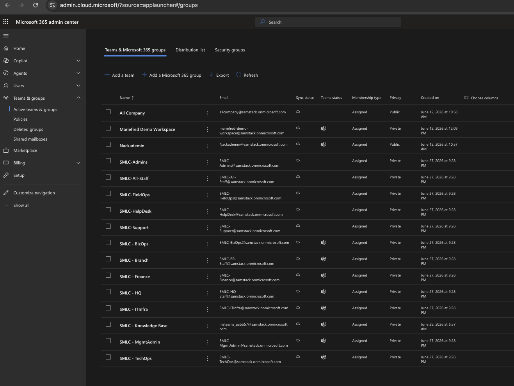
_Active teams and groups page, showing the eight SMLC teams alongside the tenant's existing items._

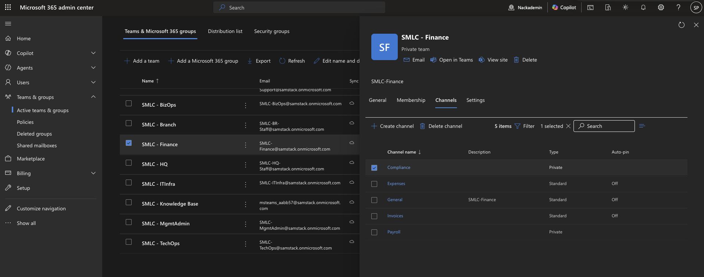
_Channels list for SMLC - Finance, showing the Payroll and Compliance channels marked Private next to the standard channels._

SharePoint sites, SharePoint permissions, admin role assignments, and guest users are still untouched. With the Teams structure now matching the approved departments, the next step can move on to SharePoint.

Step 05 — SharePoint Sites and Folder Structure

Every Microsoft 365 group already has a SharePoint site attached to it from the moment the group is created, so most of the SharePoint structure for SMLC was already sitting in the tenant once the groups from Step 03 existed. This step went through the ten sites in the approved design, confirmed the eight that already existed, created the two that did not, and then built the agreed folder structure inside each one.

Eight of the ten sites needed no new work: SMLC-HQ, SMLC-Branch, SMLC-MgmtAdmin, SMLC-ITInfra, SMLC-TechOps, SMLC-BizOps, SMLC-Finance, and SMLC-KnowledgeBase are the sites that came automatically with their matching Microsoft 365 group. SMLC-Policies and SMLC-Templates have no department group behind them in the approved design, so these two were created as new Communication Sites instead, owned by the same management account that owns the SMLC-MgmtAdmin team.

```powershell
Connect-PnPOnline -Url https://samstack-admin.sharepoint.com -Interactive

New-PnPTenantSite -Title "SMLC-Policies" -Url "https://samstack.sharepoint.com/sites/SMLC-Policies" `
    -Owner "owner@samstack.onmicrosoft.com" -TimeZone 4 -Template "SITEPAGEPUBLISHING#0" -Wait
```

A few naming differences were noted while confirming the eight existing sites. SMLC-HQ and SMLC-Branch are built on the SMLC-HQ-Staff and SMLC-BR-Staff groups, so their site address still carries the "-Staff" suffix from when those groups were first created, even though the group and Team were later renamed to "SMLC - HQ" and "SMLC - Branch". SMLC-KnowledgeBase is built on a Team that was created directly with no source group, so its site has a system-generated address rather than a clean SMLC name. None of the existing sites were renamed, since renaming a site address after the fact can break the links already pointing at it.

One access gap turned up while setting up the two new sites: right after creation, only the named owner account had access, so the admin completing the setup had to add their own account as a site administrator from the SharePoint admin center before any folders could be added. This is a normal check after creating a site on someone else's behalf, and it is worth confirming on any new site before assuming it is ready to use.

With the ten sites confirmed, the agreed folder structure was added to the default document library of each one:

| Site | Folders |
|---|---|
| SMLC-HQ | Announcements, Company Policies, Templates, Forms, General Documents |
| SMLC-Branch | Branch Operations, Field Visits, Customer Notes, Branch Reports, Local Procedures |
| SMLC-MgmtAdmin | HR Records, Employee Documents, Contracts, Internal Policies, Management Reports |
| SMLC-ITInfra | Network Documentation, Firewall Rules, Microsoft 365 Admin, Server Documentation, Backup Records, Security Incidents, Change Logs |
| SMLC-TechOps | Support Procedures, Software Packages, Customer Notes, Field Reports, Troubleshooting Guides, Escalations |
| SMLC-BizOps | Sales Leads, Marketing, Customer Requests, Reports, Customer Documents |
| SMLC-Finance | Invoices, Payroll, Expenses, Tax, Reports, Vendor Payments |
| SMLC-KnowledgeBase | Support Guides, Troubleshooting, Known Issues, Internal Procedures |
| SMLC-Policies | Company Policies, Security Policies, HR Policies, IT Policies |
| SMLC-Templates | Forms, Letter Templates, Report Templates, Customer Templates |

PnP PowerShell needed a fresh sign-in for every individual site it connected to, which was not practical across ten sites in a row. Instead, the folders were added by calling the SharePoint REST API directly from the browser, while already signed in to the site:

```javascript
const digest = await fetch(`${siteUrl}/_api/contextinfo`, { method: "POST" });
await fetch(`${siteUrl}/_api/web/folders/add('Shared Documents/Invoices')`, {
    method: "POST",
    headers: { "X-RequestDigest": digestValue }
});
```

Permissions were kept simple in this step, matching the group-based access model already in place: the eight group-connected sites keep the same owners as their Microsoft 365 group, and the two new sites have only their named owner set. No Members or Visitors groups were customised and no sharing settings were changed, since that work belongs to the SharePoint permissions step that follows this one.

Four reports were saved for this step:

- Reports/SharePoint_Sites/01_SitesCreatedOrConfirmed.csv
- Reports/SharePoint_Sites/02_FoldersCreated.csv
- Reports/SharePoint_Sites/03_OwnersAndSharing.csv
- Reports/SharePoint_Sites/04_ErrorsAndLimitations.csv

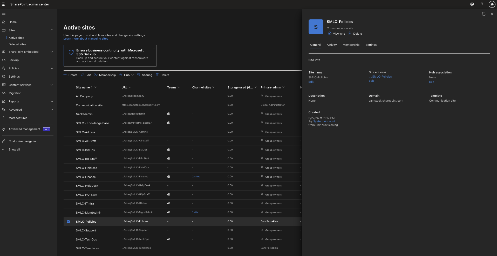
_Active sites page, showing the ten SMLC SharePoint sites alongside the tenant's existing items._

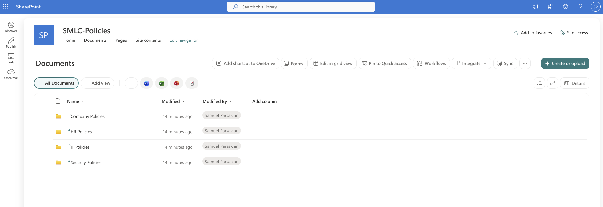
_Documents library for SMLC-Policies, showing the four policy folders created for that site._

Permissions on these sites are still sitting at their defaults, and nobody has touched admin roles or guest access yet. That is the natural next piece of work, now that the sites and folders themselves are ready.

Step 06 — SharePoint Permission Model

The previous step left one open item: when SMLC-Policies and SMLC-Templates were created, only their named owner had access, and the second owner could not be added straight away. This step started by fixing that, then went through all ten sites to apply the group-based permission model agreed for SMLC.

The second owner was added successfully this time, now that the access gap on the two sites was already closed. The same account was also set as a full site collection administrator on both sites, not only a member of the Owners group, which matches what "second owner" is meant to cover.

```javascript
const digest = await fetch(`${siteUrl}/_api/contextinfo`, { method: "POST" });
await fetch(`${siteUrl}/_api/web/associatedownergroup/users`, {
    method: "POST",
    headers: { "X-RequestDigest": digestValue },
    body: JSON.stringify({ "__metadata": { "type": "SP.User" }, "LoginName": "operations.manager@samstack.onmicrosoft.com" })
});
```

The rest of the work followed the agreed permission table, using the Microsoft 365 groups already in place rather than individual accounts, so that access stays correct automatically as people join or leave a department:

| Site | Change made |
|---|---|
| SMLC-HQ | SMLC-ITInfra added as an additional owner; SMLC-Branch given optional read access |
| SMLC-Branch | SMLC-ITInfra added as an additional owner; SMLC-MgmtAdmin given optional read access |
| SMLC-MgmtAdmin | No change - kept restricted to MgmtAdmin only |
| SMLC-ITInfra | No change - kept restricted to ITInfra only |
| SMLC-TechOps | SMLC-ITInfra added as an additional owner, covering its support role across FieldOps and Support |
| SMLC-BizOps | SMLC-MgmtAdmin added as an additional owner |
| SMLC-Finance | No change - kept restricted to Finance only |
| SMLC-KnowledgeBase | SMLC-TechOps and SMLC-ITInfra added with edit access; SMLC-All-Staff given read-only access |
| SMLC-Policies | SMLC-MgmtAdmin and SMLC-ITInfra added as owners, SMLC-MgmtAdmin given edit access, SMLC-All-Staff given read-only access |
| SMLC-Templates | SMLC-MgmtAdmin and SMLC-ITInfra added as owners, SMLC-MgmtAdmin given edit access, SMLC-All-Staff given read-only access |

Every group could be added directly by its email address, the same way a person would be added, since Microsoft 365 groups can act as SharePoint permission principals on their own. Finance, MgmtAdmin, and ITInfra were deliberately left untouched, since the design calls for these three to stay closed to general staff.

External sharing was turned off on all ten sites as the last part of this step, so none of them can be shared with people outside the organisation:

```powershell
Connect-PnPOnline -Url https://samstack-admin.sharepoint.com -Interactive
Set-PnPTenantSite -Identity "https://samstack.sharepoint.com/sites/SMLC-Finance" -SharingCapability Disabled
```

Six reports were saved for this step:

- Reports/SharePoint_Permissions/01_PermissionActions.csv
- Reports/SharePoint_Permissions/02_OwnersSnapshot.csv
- Reports/SharePoint_Permissions/03_MembersSnapshot.csv
- Reports/SharePoint_Permissions/04_VisitorsSnapshot.csv
- Reports/SharePoint_Permissions/05_SharingCapability.csv
- Reports/SharePoint_Permissions/06_ErrorsAndLimitations.csv

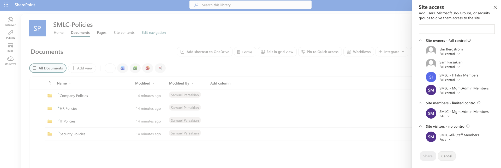
_Site permissions page for SMLC-Policies, showing operations.manager listed as a site owner alongside the MgmtAdmin and ITInfra groups._

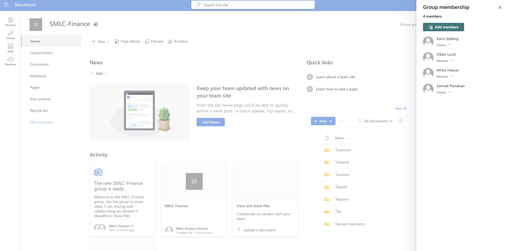
_Group membership panel for SMLC-Finance, showing access limited to the Finance team only._

Admin roles and guest access still have not been looked at. SharePoint itself is in a good place now though, with permissions matching the design and external sharing turned off everywhere, so Exchange Online and its mail security rules are next.

Step 07 — Exchange Online and Basic Email Security

The mailboxes, shared mailboxes, and distribution lists were already set up back in Step 03, but nothing had been done yet to protect the mail flow itself. This step went back over that setup to confirm it was still correct, then added a small set of mail flow rules that any small company would normally turn on early: a warning for mail coming from outside the company, and a block on the file types most often used to deliver malware.

```powershell
Connect-ExchangeOnline

New-TransportRule -Name "SMLC - External Sender Warning" `
    -FromScope NotInOrganization -SentToScope InOrganization `
    -ApplyHtmlDisclaimerLocation Prepend -ApplyHtmlDisclaimerFallbackAction Wrap `
    -ApplyHtmlDisclaimerText "Caution: this email came from an external sender. Do not click links or open attachments unless you recognise the sender."

New-TransportRule -Name "SMLC - Block Risky Attachments" `
    -AttachmentExtensionMatchesWords exe,bat,cmd,scr,vbs,js,ps1,msi,hta,jar,reg `
    -RejectMessageReasonText "This file type is blocked for security reasons. Contact IT support if you need to share this file."
```

Before either rule was created, the tenant had no mail flow rules at all, so both went in cleanly. The five sensitive distribution lists from Step 03 - All Staff, Management, HR, Finance, and Security - were checked again and still only accept mail from the management group, exactly as they were left. Permissions on the nine shared mailboxes were also checked against the original design and matched: each one still grants full access and send-as rights to the same department staff it was set up for, and nothing else. None of the 35 mailboxes in the tenant had any forwarding rule configured, which is the expected state for a tenant that has not been touched by anyone outside the project.

One setting still could not be finished. Blocking automatic forwarding to external addresses is normally done through the outbound spam filter policy, but this tenant had never had any policy customisation applied before, which Exchange Online requires as a one-time step first. That one-time step was run, and the forwarding setting was checked again on a separate day to give it time to take effect, but it is still being rejected with the same message. AutoForwardingMode is therefore left at the tenant default for now, not yet switched to Off. This was checked twice across two sessions and both times no mailbox in the tenant had any forwarding rule configured at all, so there is no real exposure while this setting finishes propagating on Microsoft's side.

Anti-spam, anti-malware, and basic anti-phishing protection were all confirmed present and active, since these come as standard with every Exchange Online mailbox. Safe Links and Safe Attachments, which catch malicious links and attachments at the moment someone opens them, belong to Microsoft Defender for Office 365 and are not part of the Business Basic plan SMLC is using - both are noted here as a planned upgrade rather than something missing by mistake. The security@samstack.onmicrosoft.com mailbox used for alerts was also confirmed to still exist and hold the same access it was given in Step 03.

Eight reports were saved for this step:

- Reports/Exchange_Security/00_TransportRules_Before.csv
- Reports/Exchange_Security/01_AcceptedDomains.csv
- Reports/Exchange_Security/02_TransportRules.csv
- Reports/Exchange_Security/03_DistributionListRestrictions.csv
- Reports/Exchange_Security/04b_OutboundForwardingPolicy.csv
- Reports/Exchange_Security/05_MailboxForwardingStatus.csv
- Reports/Exchange_Security/06_SharedMailboxPermissions.csv
- Reports/Exchange_Security/07_AntiSpamMalwarePhishingAvailability.csv

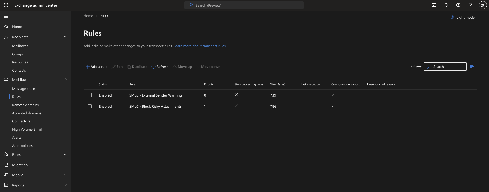
_Mail flow page in the Exchange admin center, showing the two new SMLC rules enabled and enforced._

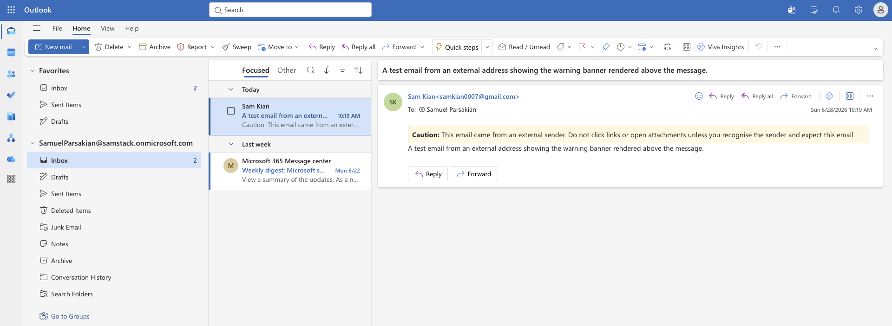
_An email received from outside the organisation, showing the warning banner added above the message body._

Conditional access, MFA, and the remaining Defender features are still ahead. The auto-forwarding block stays on the list as the one open item from this step, to be switched on once Microsoft's side catches up - everything else is in place, which is enough to move on and look at how Microsoft 365 itself is running: service health and the message centre.

Step 08 — Service Health and Message Center

A tenant does not run in isolation, so part of looking after it is keeping an eye on what Microsoft itself is reporting about the service. This step was a short review of two pages in the admin center rather than a configuration change: Service health, which shows whether anything is currently broken, and Message center, which lists upcoming changes Microsoft is rolling out.

Service health showed three advisories at the time of the check - a minor meeting room availability glitch in Exchange Online, a webhook notification issue in Microsoft To Do, and a SharePoint Online search schema display issue. All three were Microsoft-side advisories rather than outages, and none of them affect anything SMLC depends on. Every other listed service, including Teams, SharePoint, Exchange, and Entra, showed as healthy.

Message center had 404 items, far too many to read individually, so the review focused on picking out the ones that actually matter. One stood out: an update saying Microsoft Entra ID self-service password reset will require a registered authentication method from everyone starting 6 September 2026. This is worth tracking closely, since SMLC has not set up multi-factor authentication or conditional access yet - once that work starts, every user account will need a registered method in place before the deadline, or that person will not be able to reset their own password and will need an admin to do it manually instead.

Two reports were saved for this step:

- Reports/Service_Health_Message_Center/01_ServiceHealth.csv
- Reports/Service_Health_Message_Center/02_MessageCenterHighlight.csv

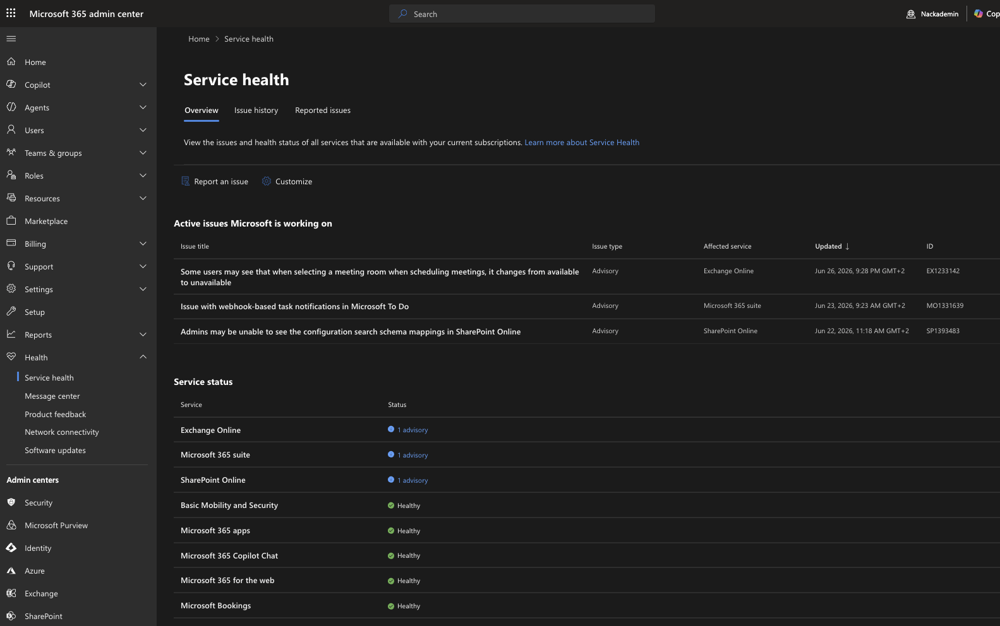
_Service health page, showing the three active advisories and the healthy status of the remaining services._

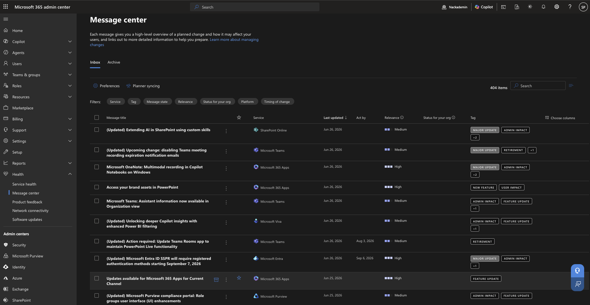
_Message center inbox, showing the volume and range of messages Microsoft sends to tenant admins._

Nothing here needed fixing today, but the password reset change is worth remembering for later, since MFA and conditional access have not been set up yet and that deadline will matter once they are. After this, it felt like a good time to sit down and actually look through who has access to what across the tenant.

Step 09 — Manual Access Review and Guest Access Test

This was the closing check for Part 1: going back through every group, looked at from the angle of "does this person actually need to be here," and then trying out what happens when an outside guest is added to the mix.

Membership in Finance, MgmtAdmin, ITInfra, BizOps, TechOps, and Knowledge Base was pulled and checked against the original design, alongside the dedicated security groups (SG-SMLC-Finance-Private, SG-SMLC-HR-Private, SG-SMLC-ITInfra-Private, SG-SMLC-TechOps-Tools, SG-SMLC-FieldOps-RemoteAccess). Everything matched: Finance still has only its three Finance staff, ITInfra still has only its six IT staff, and nobody outside HR sits in the HR security group. Knowledge Base, Policies, and Templates were not re-checked from scratch, since nothing has touched SharePoint since Step 06 - their read-only all-staff access is still on record there.

The admin-only and break-glass accounts were the other half of this check. All ten of them - the eight `adm-` accounts plus the two break-glass accounts - sit in exactly two places, SMLC-Admins and SG-SMLC-M365-Admins, and nowhere else. None of them turned up in any department group, any security group, any Team, or any shared mailbox. Daily work and emergency access stay completely separate, exactly as they were set up back in Step 02.

The second half of the step was trying to add two guest users for testing: a vendor contact for TechOps and a clinic contact for BizOps, each meant to get a small, limited slice of access and nothing more. Both invitations were rejected outright by the tenant before anything could be created. Tracking down why took a few checks - the setting that controls who can send invitations was already wide open, there were no Conditional Access policies in place, and the cross-tenant collaboration settings allowed external users by default. The actual cause turned out to be Security Defaults, which is switched on for this tenant and enforces baseline protections, including around multi-factor authentication, before sensitive actions like inviting a guest are allowed to go through. Since MFA has not been set up for anyone yet - the same gap flagged in the previous step's Message Center review - the invitation never had a chance.

No guest accounts exist in the tenant as a result, which is arguably the better outcome for this stage: it shows the tenant is refusing external access on its own, before any access decision even had to be made. Turning that protection off just to push two test accounts through would have defeated the point of running this check in the first place, so it was left exactly as it was found.

Six reports were saved for this step:

- Reports/Manual_Access_Review/01_GroupMembership.csv
- Reports/Manual_Access_Review/02_AdminSeparationCheck.csv
- Reports/Manual_Access_Review/03_AdminAccountScope.csv
- Reports/Manual_Access_Review/04_ErrorsAndLimitations.csv
- Reports/Guest_Access_Test/01_GuestsCreated.csv
- Reports/Guest_Access_Test/09_RootCauseAndConclusion.csv

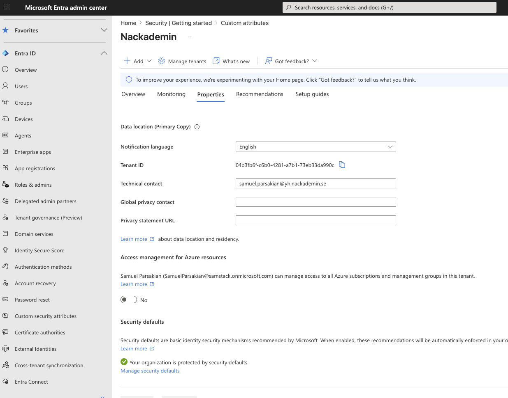
_Microsoft Entra admin center, showing Security Defaults switched on for the tenant._

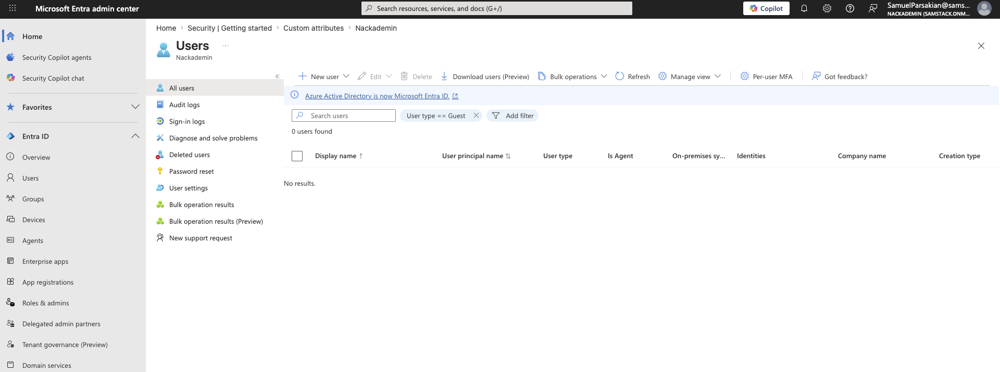
_Users list filtered to guest accounts, showing none exist after the blocked invitation attempt._

This closes out Part 1. Every account, group, site, and mailbox has been checked against the design at least once, and the one open door - guest access - turned out to already be locked. Part 2 picks up from here with onboarding, offboarding, and incident response.
