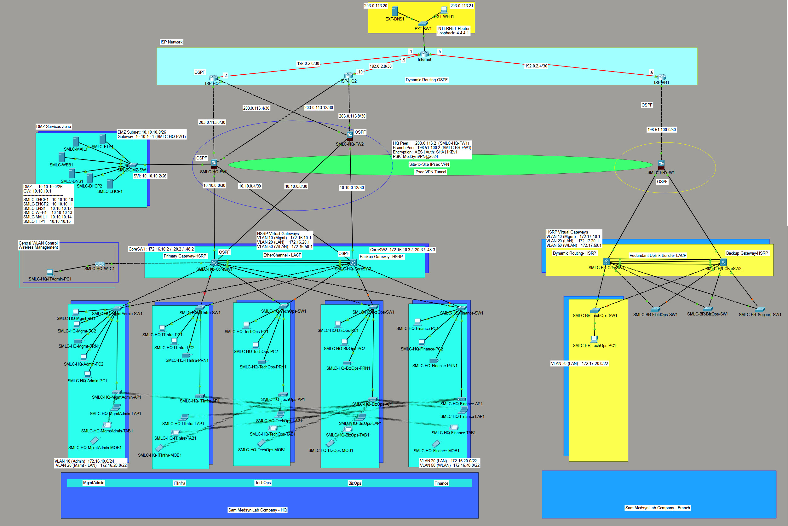
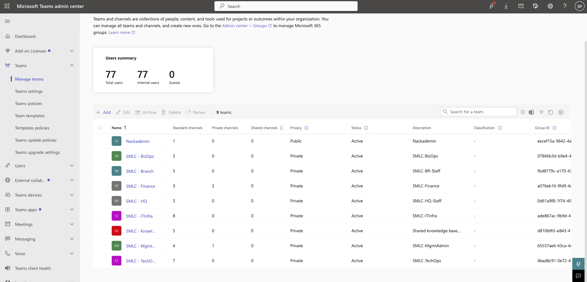
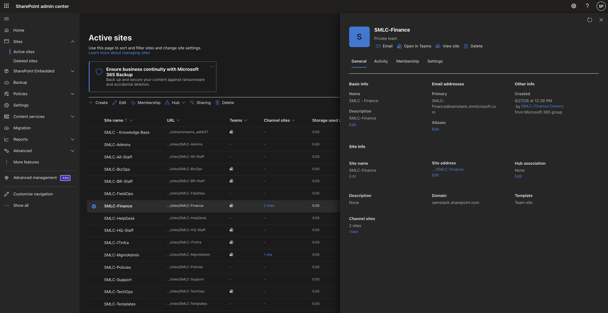
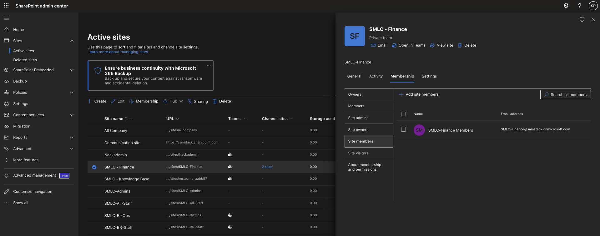
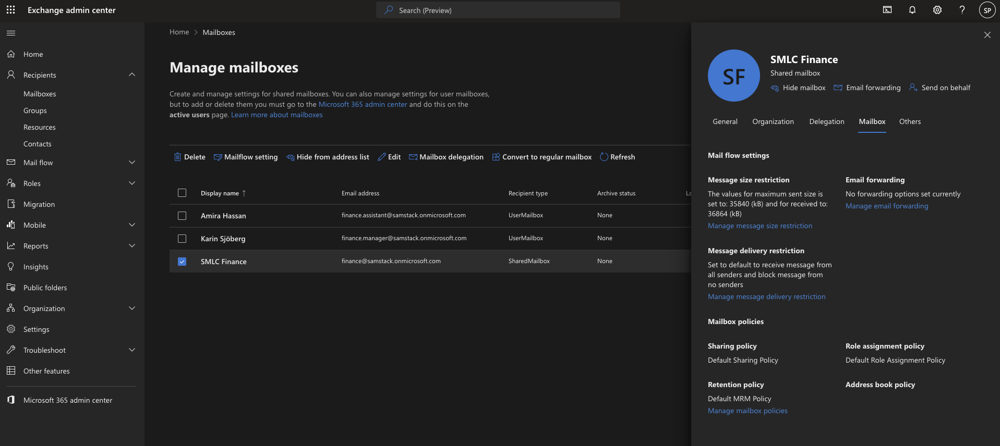
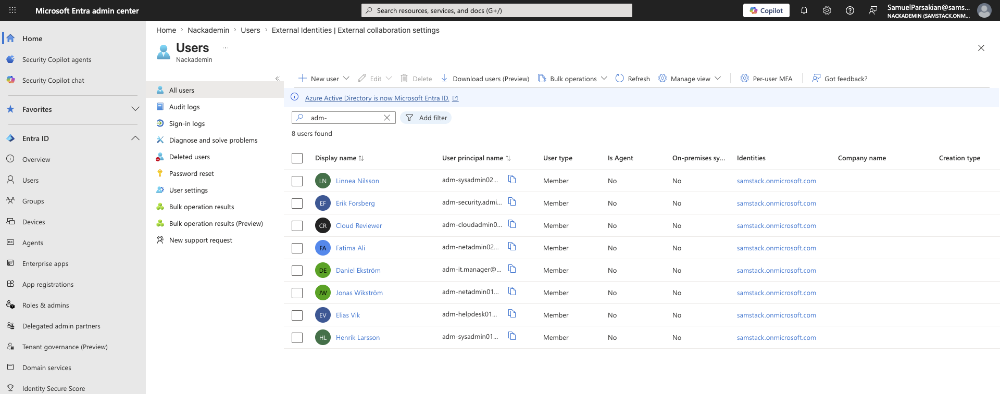

# MedSyn Microsoft 365 Tenant Administration

Microsoft 365 tenant configuration and administration project for a medical technology company focused on digital systems for medical imaging. The project covers user provisioning, licensing, groups, Teams, SharePoint, Exchange Online, security controls, access review, onboarding, offboarding, and incident response.

## Project Snapshot

The Microsoft 365 tenant was built from the same company model as the network design: headquarters, branch operations, department separation, and controlled access to collaboration and mail resources.

  

| Teams structure | SharePoint sites |
|---|---|
|  |  |

| SharePoint permissions | Exchange shared mailbox | Entra admin accounts |
|---|---|---|
|  |  |  |

## Project Context

Sam Medsyn Lab Company AB is a fictional medical technology company with headquarters and branch operations. The Microsoft 365 tenant was configured to match the company's departments, locations, collaboration needs, and baseline security requirements.

The project starts from a business scenario and two source CSV files, then documents the configuration work step by step with exported reports and screenshots.

## Core Work Completed

- Captured the original Microsoft 365 tenant baseline.
- Created staff, admin-only, and break-glass accounts from CSV source data.
- Assigned available Microsoft 365 Business Basic licenses.
- Built Microsoft 365 groups, security groups, distribution lists, and shared mailboxes.
- Created the Teams structure for departments and shared knowledge areas.
- Confirmed and configured SharePoint sites, folders, and permissions.
- Disabled external sharing on SharePoint sites.
- Added Exchange Online mail flow rules for external sender warnings and risky attachments.
- Reviewed Service Health and Message Center.
- Completed a manual access review and guest access test.
- Tested onboarding, offboarding, and incident response workflows.
- Exported the tenant's final configuration as a read-only evidence set.

## Repository Structure

| Path                                 | Purpose                                                                                                  |
| ------------------------------------ | -------------------------------------------------------------------------------------------------------- |
| [`Documents/`](Documents/)           | Business scenario, source CSV files, and network design image                                            |
| [`Project_Record/`](Project_Record/) | Main project documentation with screenshots and step-by-step configuration notes                         |
| [`Reports/`](Reports/)               | Exported CSV and JSON reports from Microsoft 365, Exchange Online, SharePoint, Teams, and access reviews |
| [`Tenant_Configuration_Export/`](Tenant_Configuration_Export/) | Read-only export of the tenant's final configuration, including scripts and output files                |
| [`.gitignore`](.gitignore)           | Repository ignore rules                                                                                  |

## Main Documentation

| Document                                                                                       | Description                                                                                |
| ---------------------------------------------------------------------------------------------- | ------------------------------------------------------------------------------------------ |
| [`Documents/business scenario.md`](Documents/business%20scenario.md)                           | Initial company scenario and configuration requirements                                    |
| [`Documents/SMLC_company_master_data.csv`](Documents/SMLC_company_master_data.csv)             | Company, department, location, mailbox, group, and sensitivity source data                 |
| [`Documents/SMLC_people_master_data.csv`](Documents/SMLC_people_master_data.csv)               | Staff, admin-only, break-glass, and guest account source data                              |
| [`Project_Record/MedSyn_M365_Project_Record.md`](Project_Record/MedSyn_M365_Project_Record.md) | Full implementation record with commands, decisions, screenshots, reports, and limitations |

## Evidence and Reports

The `Reports/` folder contains exported evidence from each major project area:

- tenant baseline
- user provisioning and license usage
- groups, distribution lists, and shared mailboxes
- Teams creation
- SharePoint sites and permissions
- Exchange Online security checks
- Service Health and Message Center review
- manual access review and guest access test
- onboarding, offboarding, and incident response

Screenshots used in the project record are stored in [`Project_Record/images/`](Project_Record/images/).

## Tenant Configuration Export

[`Tenant_Configuration_Export/`](Tenant_Configuration_Export/) contains a read-only export of the final SMLC Microsoft 365 tenant configuration.

The main project record documents how the tenant was built and tested. The tenant configuration export records what was present in the tenant at the end of the project by saving the live configuration into CSV files. This creates a final evidence set that sits alongside the step-by-step reports.

Nothing in this folder changes the tenant. The scripts only read configuration data and save it under `Tenant_Configuration_Export/output/`.

The export is separate from `Reports/` because `Reports/` contains snapshots collected during each project step. `Tenant_Configuration_Export/` is a final top-to-bottom export completed after the build, review, and test work was finished.

Export coverage:

1. [`Export-Identity.ps1`](Tenant_Configuration_Export/scripts/Export-Identity.ps1) - users, licenses, groups, group membership, admin roles, guest users, Teams, tenant security policy, Service Health, and Message Center.
2. [`Export-ExchangeConfig.ps1`](Tenant_Configuration_Export/scripts/Export-ExchangeConfig.ps1) - mailboxes, shared mailbox permissions, distribution lists, sender restrictions, mail flow rules, and Exchange security policy state.
3. [`Export-SharePointTenant.ps1`](Tenant_Configuration_Export/scripts/Export-SharePointTenant.ps1) - SharePoint site list and tenant-level sharing settings.
4. [`browser-console-export-sharepoint-permissions.js`](Tenant_Configuration_Export/scripts/browser-console-export-sharepoint-permissions.js) - site-level Owners, Members, and Visitors groups from a signed-in SharePoint browser session.

## Tools and Services Used

- Microsoft 365 admin center
- Microsoft Entra ID
- Microsoft Graph PowerShell
- Exchange Online PowerShell
- Microsoft Teams PowerShell
- SharePoint Online / PnP PowerShell
- SharePoint REST API
- Microsoft Teams
- SharePoint Online
- Exchange Online

## Notes

The planned company domain is `sammedsynlab.com`, with the public website listed as `https://www.sammedsynlab.com`. The actual tenant used during configuration relied on the available Microsoft 365 tenant domain, so some implementation records and exported reports contain `samstack.onmicrosoft.com` and `samstack.sharepoint.com` addresses.

Some advanced security features, such as Conditional Access, Safe Links, Safe Attachments, Intune management, and sensitivity labels, depend on licensing beyond Microsoft 365 Business Basic. Where those features were not available, they were documented as planned improvements.

## Demo Video

